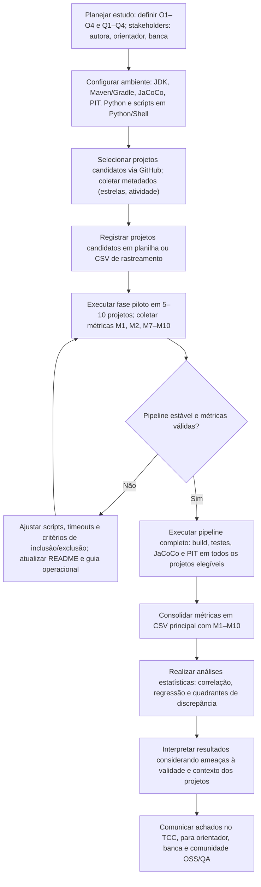

## Plano de Experimento – Scoping e Planejamento

### 1. Identificação básica

#### 1.1 Título do experimento

**Relação entre Cobertura de Código e Efetividade de Testes: Um Estudo Correlacional com Mutation Testing em Projetos Java**

#### 1.2 ID / código

plf-es-2025-2-tcci-0393100-pes-kimberly-lourenco

#### 1.3 Versão do documento e histórico de revisão

- **Versão atual:** v1.0
- **Histórico de revisões:**
  - **v1.0 (23/11/2025):** inclusão da identificação básica, contexto e problema do projeto de pesquisa.

#### 1.4 Datas (criação, última atualização)

- **Data de criação:** 23/11/2025
- **Última atualização:** 23/11/2025

#### 1.5 Autores (nome, área, contato)

- **Autora:** Kimberly Liz Spencer Lourenço
  - Área: Bacharelado em Engenharia de Software
  - Instituição: PUC Minas – Instituto de Informática e Ciências Exatas
  - E-mail: kimberly.liz@sga.pucminas.br

#### 1.6 Responsável principal (PI / dono do experimento)

- **Responsável principal (PI):** Kimberly Liz Spencer Lourenço

#### 1.7 Projeto / produto / iniciativa relacionada

- **Projeto:** Trabalho de Conclusão de Curso (TCC) em Engenharia de Software – PUC Minas
- **Tema:** Relação entre cobertura de código e efetividade de testes em projetos Java de código aberto
- **Produto esperado:**
  - Artigo científico no formato SBC;
  - Pipeline reproduzível de coleta e análise;
  - Base de dados consolidada de cobertura e _mutation score_ por projeto/módulo.
---

### 2. Contexto e problema

#### 2.1 Descrição do problema / oportunidade

Cobertura de código é amplamente utilizada como indicador de qualidade de testes, pois mostra quais linhas de código de produção são exercitadas. Porém, a cobertura não mede diretamente se os testes detectariam defeitos: é possível ter alta cobertura e, ainda assim, falhas passarem silenciosamente, especialmente em contextos críticos (pagamentos, prontuários, documentos fiscais).

Oportunidade: investigar empiricamente **em que medida a cobertura de código por linha reflete a efetividade dos testes**, aproximada neste estudo pelo _mutation score_ (proporção de mutantes mortos). Isso permite avaliar quando a cobertura pode ser usada como _proxy_ razoável de efetividade e quando ela é um indicador fraco ou enganoso.

#### 2.2 Contexto organizacional e técnico

- **Organizacional:**

  - Estudo conduzido em contexto acadêmico (TCC de Engenharia de Software – PUC Minas).
  - Base empírica formada por projetos Java de código aberto hospedados no GitHub.
  - Não há intervenção direta em times de desenvolvimento; o estudo é observacional sobre repositórios existentes.

- **Técnico:**
  - Linguagem principal: **Java**.
  - _Build tools_: **Maven** e **Gradle**, conforme cada repositório.
  - Ferramenta de cobertura: **JaCoCo** (cobertura por linha, relatórios XML/HTML).
  - Ferramenta de _mutation testing_: **PIT (pitest-maven-plugin)**, com operadores padrão.
  - Ambiente de execução: máquina/VM Linux com versões documentadas de JDK, Maven/Gradle, JaCoCo e PIT.
  - Análise de dados: scripts **Python** (pandas, scipy/statsmodels) para consolidar métricas em CSV e executar análises estatísticas.
  - Processo de coleta: pipeline automatizado (ex: _Makefile_ + _shell scripts_) contendo descoberta de repositórios, _clone_, execução de testes, coleta de cobertura, execução de mutação e parsing de relatórios.

#### 2.3 Trabalhos e evidências prévias (internos e externos)

Diversos estudos recentes dão suporte direto ao problema investigado neste trabalho, tanto ao questionar o uso isolado da cobertura de código como métrica de qualidade quanto ao consolidar o _mutation score_ como proxy de efetividade de testes.

- **Ivanković et al. (2024)** – mostram que apresentar apenas linhas não cobertas tende a saturar os autores mostram que simplesmente apresentar uma lista extensa de linhas não cobertas tende a sobrecarregar os desenvolvedores e nem sempre orienta ações concretas de melhoria. A abordagem _Productive Coverage_ busca tornar a cobertura mais útil ao priorizar trechos relevantes do código com base em sinais de uso em produção e similaridade com código bem testado. Esse resultado reforça que a cobertura “bruta” (apenas o percentual global ou o conjunto de linhas não cobertas) não é, sozinha, um bom guia de qualidade de testes.

- **Petrović et al. (2023)** – o estudo acompanha mutantes exibidos durante _code review_ e analisa o que acontece com eles ao longo de diversos _pull requests_. Em muitos casos, esses mutantes motivam mudanças concretas na base de código, como a inclusão de novos testes, refatorações e ajustes na lógica de produção. Esses achados sustentam a visão de que mutantes bem selecionados são capazes de induzir melhorias reais em código e testes, fortalecendo o uso de _mutation testing_ como sinal direto do poder de detecção da suíte de testes.

- **Straubinger et al. (2024)** – investigam mutantes semanticamente equivalentes, isto é, mutantes em que a alteração introduzida não muda o comportamento observável do programa em relação ao código original. Nesses casos, não há um “defeito real” a ser detectado: mesmo uma suíte de testes altamente efetiva nunca conseguirá matar esses mutantes. No entanto, no cálculo do _mutation score_, esses mutantes equivalentes são contabilizados no denominador (total de mutantes) e, por nunca serem mortos, reduzem artificialmente o valor da métrica, como se representassem defeitos não detectados. Assim, a presença de mutantes equivalentes não é um problema para o funcionamento do sistema em si, mas para a precisão da métrica de mutação, pois pode fazer a suíte de testes parecer menos efetiva do que realmente é. Esse efeito introduz ruído nas análises que relacionam cobertura e _mutation score_ e precisa ser considerado como ameaça à validade ao interpretar os resultados deste estudo.

- **Ashong et al. (2025)** – este trabalho compara diferentes estratégias de seleção de mutantes, incluindo amostragem aleatória e abordagens estratificadas por arquivo ou por operador, com o objetivo de aproximar o _mutation score_ obtido por mutação completa. Os resultados indicam que não há uma técnica universalmente superior em todos os cenários, mas que estratégias estratificadas tendem, com frequência maior, a produzir estimativas mais próximas do _mutation score_ real, especialmente quando a suíte de testes é razoavelmente robusta. Isso é particularmente relevante quando o consumo de recursos computacionais ultrapassaria o que é aceitável para o projeto.

- **Veloso & Hora (2022)** – os autores caracterizam métodos de teste de alta qualidade em projetos Java por meio de _mutation testing_ em nível de método. Eles observam que métricas simples, como tamanho dos métodos de teste ou número de _asserts_, não diferenciam adequadamente métodos de alta e baixa qualidade. Em contraste, a menor incidência de _test smells_ críticos aparece como um indicador mais consistente de qualidade. Esses resultados sugerem que métricas agregadas, incluindo cobertura global, podem mascarar variações locais de qualidade, enquanto o _mutation score_ e a análise de _test smells_ capturam melhor a efetividade real dos testes.

- **Teixeira et al. (2024)** – o trabalho apresenta a ferramenta METEOR, que utiliza _mutation testing_ (baseado em PIT) para monitorar a preservação de comportamento em refatorações de código de teste. A ferramenta compara o _mutation score_ antes e depois das refatorações, sinalizando potenciais perdas de poder de detecção. Esse estudo reforça o _mutation score_ como uma métrica prática e sensível para avaliar a efetividade dos testes em cenários reais de evolução de código.

#### 2.4 Referencial teórico e empírico essencial

O referencial deste estudo se organiza em quatro eixos principais: (i) cobertura de código e suas limitações como métrica de qualidade, (ii) _mutation testing_ e _mutation score_ como aproximação da efetividade dos testes, (iii) qualidade de testes e _test smells_, e (iv) métodos estatísticos para estudos correlacionais em Engenharia de Software.

**Cobertura de código.** Cobertura de código é uma métrica estrutural que indica qual fração do código de produção é exercitada pelos testes automatizados. Critérios como cobertura por linha, por ramo e por instrução são amplamente monitorados em pipelines de integração contínua e em políticas de qualidade, sobretudo em contextos industriais e _safety-critical_. No entanto, a cobertura registra apenas a execução de trechos de código, não garantindo que comportamentos relevantes sejam devidamente verificados por _asserts_ ou oráculos adequados. Trabalhos como Ivanković et al. reforçam que exibir simplesmente “linhas não cobertas” tende a saturar os desenvolvedores e não necessariamente direciona para ações que aumentem o poder de detecção de defeitos, sugerindo que a cobertura, isoladamente, é um indicador limitado da efetividade dos testes.

**Teste de mutação e _mutation score_.** Teste de mutação é uma técnica que avalia a qualidade da suíte de testes ao introduzir pequenas alterações sintáticas no código de produção (mutantes) e verificar se os testes conseguem “matar” esses mutantes, isto é, produzir falhas observáveis. O _mutation score_ é definido como a proporção de mutantes mortos em relação ao total de mutantes válidos. Essa métrica é amplamente utilizada como aproximação da efetividade dos testes, pois mede explicitamente se a suíte distingue entre o comportamento original e versões levemente alteradas do código. Estudos recentes com ferramentas como PIT e METEOR mostram que o _mutation score_ é sensível a mudanças na qualidade dos testes e pode indicar perda de poder de detecção após refatorações. Ao mesmo tempo, questões como mutantes semanticamente equivalentes e custo computacional exigem cuidado: identificação imperfeita de equivalentes pode distorcer o denominador do _mutation score_, e a execução de mutantes em larga escala demanda estratégias como amostragem.

**Qualidade de testes, _test smells_ e relação cobertura vs efetividade.** A literatura aponta que a qualidade de uma suíte de testes não pode ser reduzida a métricas simples como contagem de testes ou cobertura. Trabalhos como o de Veloso e Hora mostram que métodos de teste de alta qualidade tendem a apresentar menos _test smells_ críticos, mesmo quando tamanho e número de _asserts_ são similares aos de baixa qualidade. Além disso, estudos que acompanham mutantes durante _code review_ indicam que mutantes acionáveis levam a melhorias concretas no código e nos testes. Esses resultados convergem para a visão de que cobertura e _mutation score_ capturam dimensões diferentes: a primeira foca alcance estrutural, enquanto a segunda foca capacidade efetiva de detecção. Compreender a relação entre essas métricas em múltiplos projetos é essencial para orientar práticas de QA e decisões sobre quando a cobertura pode servir (ou não) como _proxy_ razoável de efetividade.

**Métodos estatísticos em estudos correlacionais.** Do ponto de vista metodológico, este estudo adota técnicas estatísticas típicas de investigações correlacionais em Engenharia de Software. Serão utilizados coeficientes de correlação (em especial o de Spearman, adequado para relações monotônicas possivelmente não lineares e menos sensível a _outliers_), modelos de regressão linear simples e análise de quadrantes de discrepância (por exemplo, casos de alta cobertura e baixo _mutation score_ e o inverso). Além disso, empregaremos técnicas de reamostragem do tipo _bootstrap_, nas quais são geradas múltiplas “amostras artificiais” a partir dos próprios dados, por sorteio com reposição, para estimar a distribuição das estatísticas e construir intervalos de confiança sem depender de suposições fortes de normalidade. Em conjunto, esses métodos permitem quantificar a associação entre cobertura por linha e _mutation score_, avaliar em que medida a cobertura explica a variabilidade observada e caracterizar padrões em subgrupos de projetos. A interpretação dos resultados considerará explicitamente ameaças à validade interna (influência de fatores não controlados), à validade de construto (quão bem as métricas de cobertura e *mutation score* realmente representam os conceitos de “alcance” e “efetividade” dos testes que este estudo pretende analisar), à validade de conclusão (limitações dos testes estatísticos utilizados) e à validade externa (possibilidade de generalizar os achados para outros contextos), reconhecendo que se trata de um estudo observacional com projetos de código aberto.

---

### 3. Objetivos e questões (Goal / Question / Metric)

#### 3.1 Objetivo geral

> **Analisar**, do ponto de vista de uma pesquisadora em Engenharia de Software, **projetos Java de código aberto** com testes automatizados, com o propósito de **investigar a relação entre cobertura de código por linha e *mutation score***, no contexto de um estudo quantitativo correlacional, a fim de avaliar em que medida a cobertura pode ser usada como *proxy* da efetividade dos testes.

#### 3.2 Objetivos específicos

- **O1:** Estimar a associação entre cobertura de código por linha e *mutation score* por projeto/módulo e verificar sua significância estatística.
- **O2:** Identificar e caracterizar casos em que há:
  - alta cobertura e baixo *mutation score*; e  
  - baixa/média cobertura e *mutation score* relativamente alto,  
  descrevendo padrões recorrentes em código e testes nesses cenários.
- **O3:** Ajustar modelos de regressão linear simples do *mutation score* em função da cobertura de código por linha e avaliar o quanto a cobertura explica a variabilidade do *mutation score*.
- **O4:** Compreender em que condições práticas a cobertura pode (ou não) ser usada como *proxy* da efetividade dos testes, combinando evidências de correlação, regressão e discrepâncias.

### 3.3 GQM (Goal — Question — Metric)

| Objetivo | Pergunta | Métricas |
|---|---|---|
| **O1: Associação cobertura–efetividade** Investigar a relação entre cobertura de código por linha e *mutation score* em projetos Java de código aberto. | **Q1.1:** Qual é a força e a direção da associação entre cobertura de código por linha e *mutation score* em projetos Java de código aberto? | M1: Cobertura de código por linha (%); M2: *Mutation score* (%); M3: Correlação de Spearman (ρ); M4: Correlação de Pearson (r), quando aplicável |
| **O1: Associação cobertura–efetividade** | **Q1.2:** Essa associação se mantém estável quando removemos projetos extremos (por exemplo, *outliers* em cobertura ou *mutation score*)? | M1: Cobertura de código por linha (%); M2: *Mutation score* (%); M3: Correlação de Spearman (ρ) com e sem *outliers* |
| **O1: Associação cobertura–efetividade** | **Q1.3:** A força da associação entre cobertura e *mutation score* varia de forma relevante entre faixas de tamanho de projeto ou de tamanho da suíte de testes? | M1: Cobertura de código por linha (%); M2: *Mutation score* (%); M3: Correlação de Spearman (ρ) por estratos; M7: LOC aproximado; M8: Nº de testes automatizados |
| **O2: Casos de discrepância** Identificar e caracterizar projetos em que cobertura e *mutation score* divergem de forma relevante. | **Q2.1:** Com que frequência surgem projetos com alta cobertura e baixo *mutation score* e o inverso (baixa/média cobertura e *mutation score* alto)? | M1: Cobertura de código por linha (%); M2: *Mutation score* (%); M5: Quadrantes de discrepância (proporção por quadrante) |
| **O2: Casos de discrepância** | **Q2.2:** Que características de contexto (tamanho, número de testes, idade, operadores de mutação) aparecem com mais frequência nos projetos discrepantes? | M1: Cobertura de código por linha (%); M2: *Mutation score* (%); M5: Quadrantes de discrepância; M7: LOC aproximado; M8: Nº de testes automatizados; M9: Idade/atividade do projeto; M10: Distribuição de operadores de mutação |
| **O2: Casos de discrepância** | **Q2.3:** Como se comportam exemplos representativos de projetos discrepantes em termos de estrutura de testes (por exemplo, presença de *test smells* ou padrões de *asserts*)? | M1: Cobertura de código por linha (%); M2: *Mutation score* (%); M5: Quadrantes de discrepância; M8: Nº de testes automatizados; M10: Distribuição de operadores de mutação (por arquivo/classe selecionados) |
| **O3: Capacidade preditiva da cobertura** Ajustar modelos de regressão linear simples do mutation score em função da cobertura de código por linha e avaliar o quanto a cobertura consegue explicar ou prever a variação observada no *mutation score*. | **Q3.1:** Em que medida a cobertura de código por linha explica a variabilidade do *mutation score* quando usamos modelos de regressão linear simples? | M1: Cobertura de código por linha (%); M2: *Mutation score* (%); M6: Parâmetros de regressão (coeficiente angular, intercepto, R² ajustado, RMSE, MAE) |
| **O3: Capacidade preditiva da cobertura** | **Q3.2:** Como se comportam os erros de predição do modelo (por exemplo, RMSE e MAE) em diferentes faixas de cobertura (baixa, média, alta)? | M1: Cobertura de código por linha (%); M2: *Mutation score* (%); M6: Parâmetros de regressão (R² ajustado, RMSE, MAE por faixa de cobertura) |
| **O3: Capacidade preditiva da cobertura** | **Q3.3:** Há relação sistemática entre os resíduos do modelo (diferença entre *mutation score* observado e previsto) e variáveis de contexto como tamanho do projeto, número de testes ou idade? | M1: Cobertura de código por linha (%); M2: *Mutation score* (%); M6: Resíduos do modelo; M7: LOC aproximado; M8: Nº de testes automatizados; M9: Idade/atividade do projeto |
| **O4: Uso da cobertura como *proxy*** Compreender em que condições a cobertura pode ser usada como *proxy* da efetividade dos testes. | **Q4.1:** Em quais condições práticas (faixas de cobertura, faixas de *mutation score*, contexto dos projetos) a cobertura parece funcionar como *proxy* razoável da efetividade dos testes? | M1: Cobertura de código por linha (%); M2: *Mutation score* (%); M3: Correlação de Spearman (ρ); M5: Quadrantes de discrepância; M6: Parâmetros de regressão; M7–M10: Variáveis de apoio (LOC, nº de testes, idade do projeto, operadores de mutação) |
| **O4: Uso da cobertura como *proxy*** | **Q4.2:** Em quais condições a cobertura se mostra um indicador limitado (por exemplo, alta cobertura com *mutation score* baixo) e que fatores adicionais precisam ser considerados na interpretação? | M1: Cobertura de código por linha (%); M2: *Mutation score* (%); M5: Quadrantes de discrepância; M7–M10: Variáveis de apoio (LOC, nº de testes, idade, operadores de mutação) |
| **O4: Uso da cobertura como *proxy*** | **Q4.3:** Que recomendações práticas podem ser derivadas para o uso combinado de cobertura e *mutation score* em políticas de qualidade (por exemplo, definição de metas, uso amostral de mutação)? | M1: Cobertura de código por linha (%); M2: *Mutation score* (%); M3: Correlação de Spearman (ρ); M5: Quadrantes de discrepância; M6: Parâmetros de regressão |

---

### 3.4 Tabela de métricas (descrição e unidade)

| Métrica | Descrição | Unidade |
|---|---|---|
| **M1 – Cobertura de código por linha** | Percentual de linhas de código de produção exercitadas pela suíte de testes automatizados, conforme relatórios JaCoCo gerados após a execução dos testes. | porcentagem (%) |
| **M2 – *Mutation score* global** | Percentual de mutantes mortos em relação ao total de mutantes válidos gerados pelo PIT para o projeto/módulo analisado. | porcentagem (%) |
| **M3 – Correlação de Spearman (ρ)** | Coeficiente de correlação de Spearman entre a cobertura de código por linha (M1) e o *mutation score* (M2), capturando associações monotônicas (não necessariamente lineares). | valor adimensional (−1 a 1) |
| **M4 – Correlação de Pearson (r)** | Coeficiente de correlação de Pearson entre M1 e M2, utilizado quando os pressupostos de linearidade e distribuição aproximadamente normal dos resíduos forem razoáveis. | valor adimensional (−1 a 1) |
| **M5 – Quadrantes de discrepância** | Classificação dos projetos em quadrantes, por exemplo: QH-L (cobertura ≥ 80% e *mutation score* < 60%) e QL-H (cobertura < 60% e *mutation score* ≥ 80%), e cálculo da proporção de projetos em cada quadrante. | porcentagem (%) de projetos por quadrante |
| **M6 – Parâmetros de regressão e ajuste** | Conjunto de estatísticas do modelo de regressão linear simples do *mutation score* (M2) em função da cobertura (M1): coeficiente angular, intercepto, R² ajustado, erro quadrático médio (RMSE) e erro absoluto médio (MAE). | diversos (coeficientes adimensionais; R² adimensional; RMSE e MAE em pontos de *mutation score* (%)) |
| **M7 – LOC (Lines of Code)** | Número aproximado de linhas de código de produção do projeto/módulo (métrica de tamanho utilizada como variável de contexto). | contagem (linhas) |
| **M8 – Número de testes automatizados** | Quantidade de casos de teste automatizados presentes no projeto/módulo (por exemplo, métodos de teste JUnit). | contagem |
| **M9 – Idade / atividade do projeto** | Indicador de maturidade/atividade do projeto, como tempo desde o primeiro *commit* ou data do último *commit* relevante dentro da janela analisada. | tempo (anos/meses) ou marca temporal |
| **M10 – Distribuição de operadores de mutação** | Proporção de mutantes gerados por cada tipo de operador de mutação (por exemplo, operadores aritméticos, relacionais, lógicos), usada para contextualizar o *mutation score* obtido. | porcentagem (%) por tipo de operador |

---

### 4. Escopo e contexto do experimento

#### 4.1 Escopo funcional / de processo (incluído e excluído)
- **Incluído:**
  - Projetos Java de código aberto hospedados no GitHub com:
    - configuração de build via Maven ou Gradle;
    - presença clara de testes automatizados (dependências JUnit etc.);
    - *build* e execução de testes bem-sucedidos em ambiente padronizado.
  - Coleta de cobertura de código por linha com JaCoCo.
  - Execução de *mutation testing* com PIT em nível de projeto/módulo.
  - Consolidação de métricas (cobertura, *mutation score*, variáveis de apoio) em CSV.
  - Análises estatísticas (correlação, regressão, quadrantes de discrepância).

- **Excluído:**
  - Projetos que não compilam ou não executam testes de forma determinística no ambiente definido.
  - Outras linguagens (Kotlin, Scala, C#, etc.).
  - Métricas de cobertura que não sejam cobertura por linha (e.g., branch, instruction, path), salvo uso auxiliar.
  - Testes manuais, testes exploratórios, testes não orquestrados via Maven/Gradle.
  - Intervenções diretas no processo de desenvolvimento de equipes (o estudo não altera políticas de CI/CD dos projetos).

#### 4.2 Contexto do estudo (tipo de organização, projeto, experiência)
- **Tipo de organização:** contexto acadêmico (TCC) analisando projetos de código aberto mantidos por comunidades diversas (empresas, indivíduos, fundações).
- **Tipo de projetos:** bibliotecas, frameworks e aplicações Java com base de usuários real; variando em tamanho, idade e popularidade.
- **Criticidade:** heterogênea – alguns projetos podem ser usados em contextos críticos, outros em aplicações comuns.
- **Perfil de experiência dos “participantes”:** não há participação direta de indivíduos; a “unidade de análise” é o projeto/módulo de software. Assume-se que projetos com maior popularidade tendem a ter mantenedores experientes, mas isso não é controlado.

#### 4.3 Premissas
- Os projetos selecionados conseguem ser *buildados* e ter seus testes executados com configurações razoavelmente padronizadas (JDK compatível, versões de Maven/Gradle).
- Os relatórios de JaCoCo e PIT são gerados de forma consistente e confiável para cada projeto.
- Os testes automatizados são determinísticos o suficiente para que múltiplas execuções não gerem variações significativas nas métricas.
- A API do GitHub permanece disponível e utilizável com limites de *rate* que permitem coletar o corpus planejado.
- O ambiente de execução (VM/máquina) dispõe de recursos suficientes (CPU/RAM/tempo) para executar testes e mutação nos projetos selecionados.

#### 4.4 Restrições
- **Tempo:** o estudo precisa ser executado dentro da janela do TCC II (fev–jun/2026), limitando tamanho do corpus e profundidade das análises.
- **Recursos computacionais:** execução de PIT é custosa; isso restringe o número de projetos/módulos e a granularidade (ex.: rodar por módulo em vez de por classe).
- **Ferramentas:** uso de JaCoCo e PIT, e versões específicas de JDK, Maven/Gradle, que podem introduzir incompatibilidades com alguns projetos mais antigos ou muito recentes.
- **Acessos:** dependência da disponibilidade pública dos repositórios e da integridade do histórico de *build* (por exemplo, dependências externas que podem ficar indisponíveis).
- **Escopo acadêmico:** não há acesso a métricas internas de empresas; a análise se limita ao que é observável em projetos de código aberto.

#### 4.5 Limitações previstas
- **Validade externa:** resultados são mais diretamente válidos para projetos Java de código aberto, com certas características de popularidade/atividade, não necessariamente para sistemas proprietários ou de outros domínios tecnologicamente específicos.
- **Amostra não aleatória:** a seleção de projetos com base em filtros de linguagem, popularidade e atividade recente faz com que a amostra tenda a incluir principalmente projetos mais maduros e bem mantidos. Isso pode introduzir viés de seleção, pois os resultados obtidos podem refletir melhor o comportamento desse tipo de projeto do que o de projetos menos populares, desatualizados ou com práticas de teste menos consolidadas.

- **Medição imperfeita:** presença de mutantes equivalentes e possíveis falhas de cobertura/relatórios podem distorcer parcialmente o *mutation score* e a cobertura medida.
- **Caráter observacional:** não há controle experimental de fatores como experiência das equipes, políticas de qualidade ou domínio de aplicação; isso limita inferências causais.

---

### 5. Stakeholders e impacto esperado

#### 5.1 Stakeholders principais
- Autora do TCC (pesquisadora).
- Orientadores e banca avaliadora do TCC.
- Comunidade acadêmica de Engenharia de Software (pesquisadores em teste de software, métricas e qualidade).
- Profissionais de qualidade e testes de software.
- Desenvolvedores e mantenedores de projetos Java de código aberto.
- Equipes que utilizam cobertura em pipelines de CI/CD.

#### 5.2 Interesses e expectativas dos stakeholders
- **Autora e orientadores:**  
  - Obter evidências empíricas sólidas para responder às questões de pesquisa.  
  - Entregar um TCC tecnicamente robusto, reprodutível e alinhado à literatura recente.  
- **Banca e comunidade acadêmica:**  
  - Avaliar a qualidade metodológica do estudo.  
  - Utilizar o protocolo e a base de dados como referência para pesquisas futuras em métricas de teste.
- **Profissionais de QA e desenvolvimento:**  
    - Subsidiar a definição e a revisão de políticas que usam cobertura como KPI (*Key Performance Indicator*), apresentando em quais contextos esse indicador é confiável e em quais requer cautela.  
    - Apoiar a priorização de esforços de teste, mostrando quando aumentar apenas a cobertura tende a ter baixo retorno em detecção de defeitos e quando a combinação com métricas de mutação é mais apropriada.  
    - Oferecer orientação básica para interpretar, em conjunto, relatórios de cobertura e *mutation score* em pipelines de CI/CD.
- **Mantenedores de projetos *OSS (Open Source Software)*:**  
    - Usar os resultados como insumo para revisar metas de cobertura e práticas de teste em seus repositórios.  
    - Avaliar se a adoção, mesmo que pontual ou amostral, de *mutation testing* faz sentido em projetos mais críticos ou populares.

#### 5.3 Impactos potenciais no processo / produto
- **Nos projetos OSS analisados:**  
  - Impacto direto mínimo, pois o estudo não altera código nem testes dos repositórios; apenas executa *builds* e ferramentas de análise em clones locais.  
- **Na prática de QA:**  
  - Possível revisão de políticas que tratam cobertura como meta absoluta.  
  - Estímulo à combinação de métricas (cobertura + *mutation score* ou outras evidências) em vez de foco exclusivo em cobertura.
- **Na formação acadêmica:**  
  - Disponibilização de um estudo de caso reprodutível para ensino de métricas de teste, correlação e ameaças à validade.

---

### 6. Riscos de alto nível, premissas e critérios de sucesso

#### 6.1 Riscos de alto nível (negócio, técnicos, etc.)
- **R1 – Baixo número de projetos válidos:** muitos repositórios podem falhar em *build/test*, reduzindo o tamanho efetivo da amostra.
- **R2 – Custo computacional da mutação:** PIT pode tornar inviável rodar mutação completa para todos os projetos dentro do tempo e recursos disponíveis.
- **R3 – Flakiness de testes:** existência de testes instáveis (que às vezes passam e às vezes falham sem mudança de código), o que pode gerar métricas inconsistentes de cobertura e *mutation score*.
- **R4 – Problemas de compatibilidade:** diferenças de versão de JDK, Maven/Gradle, dependências externas quebradas.
- **R5 – Erros na automação:** bugs nos scripts de coleta/análise podem introduzir erros silenciosos nas métricas.

#### 6.2 Critérios de sucesso globais (go / no-go)
O experimento será considerado bem-sucedido se:
- **CS1:** For obtida uma amostra mínima de projetos/módulos com métricas válidas (por exemplo, ≥ 30–40 unidades de análise com cobertura e *mutation score* confiáveis).
- **CS2:** As análises forem suficientes para responder Q1–Q3 com resultados estatisticamente interpretáveis (correlações com intervalos de confiança, regressão com diagnóstico básico).
- **CS3:** O pipeline de coleta e análise estiver documentado e reprodutível (scripts + *Makefile* + documentação de ambiente).
- **CS4:** As conclusões estiverem claramente conectadas às evidências, com discussão explícita de ameaças à validade.

#### 6.3 Critérios de parada antecipada (pré-execução)
O experimento poderá ser cancelado ou replanejado antes da execução completa se:
- **CP1:** Após uma fase piloto, menos de um número mínimo de projetos (por exemplo, 10) conseguirem gerar métricas válidas, mesmo após ajustes de ambiente razoáveis.
- **CP2:** O custo de mutação se mostrar impraticável (por exemplo, tempo total estimado incompatível com o cronograma do TCC), sem possibilidade de mitigação via amostragem estratificada.
- **CP3:** Problemas técnicos graves e persistentes com ferramentas (JaCoCo, PIT, ambiente) inviabilizarem a medição confiável.
- **CP4:** Mudanças significativas no escopo do TCC (por decisão acadêmica) tornarem o experimento incoerente com os novos objetivos.

---

### 7. Modelo conceitual e hipóteses

#### 7.1 Modelo conceitual do experimento

Neste estudo, assume-se que existe um construto latente de **“efetividade da suíte de testes”** (capacidade real de detectar defeitos relevantes no código de produção). Esse construto não é diretamente observável, mas é aproximado por diferentes métricas:

- **Cobertura de código por linha (M1)** captura principalmente **o alcance estrutural** dos testes: quão bem o código de produção é exercitado.
- **Mutation score (M2)** captura principalmente **o poder de detecção**, isto é, o quão sensíveis os testes são a pequenas alterações no código (mutantes).

O modelo conceitual parte das seguintes ideias:

- Em muitos contextos, espera-se que **maior cobertura** esteja associada a **maior mutation score**, pois mais partes do código são exercitadas e, potencialmente, verificadas por asserts.
- No entanto, essa relação pode ser **mediada ou moderada** por fatores de contexto, como:
  - **Tamanho do projeto (M7)**;
  - **Número de testes automatizados (M8)**;
  - **Idade/atividade do projeto (M9)**;
  - **Distribuição de operadores de mutação (M10)**;
  - Qualidade estrutural dos testes (por exemplo, presença de *test smells*, não diretamente medida, mas relacionada ao contexto).

Assim, a cobertura (M1) e as variáveis de contexto (M7–M10) são tratadas como **variáveis explicativas/descritoras**, enquanto o mutation score (M2) é tratado como **principal variável de resposta**.  

De forma resumida, o modelo conceitual é:

> **Efetividade real dos testes (latente)**  
> → influencia tanto **M1 (alcance)** quanto **M2 (detecção)**,  
> mas **M2** tende a ser um indicador mais direto de detecção de defeitos, enquanto **M1** pode superestimar a efetividade quando testes exercitam o código sem verificações adequadas.  

O estudo busca, portanto, compreender **como M1 e M2 se relacionam empiricamente na prática**, e em quais contextos a cobertura (M1) pode ser usada como *proxy* aceitável de efetividade (M2) e em quais não.

#### 7.2 Hipóteses formais (H0, H1)

Com base nos objetivos e no modelo conceitual, as principais hipóteses podem ser organizadas em três blocos.

**Bloco 1 – Associação global entre cobertura e mutation score (O1 / Q1.1):**

- **H0₁ (nula):** Não há associação monotônica estatisticamente significativa entre **cobertura de código por linha (M1)** e **mutation score (M2)** em projetos Java de código aberto (ρ ≈ 0).
- **H1₁ (alternativa):** Existe uma associação monotônica **positiva** e estatisticamente significativa entre **M1** e **M2** (ρ > 0), indicando que projetos com maior cobertura tendem, em média, a apresentar mutation score mais alto.

**Bloco 2 – Magnitude e robustez da associação (O1 / Q1.2, Q1.3; O3 / Q3.1):**

- **H0₂:** A associação observada entre M1 e M2 é fraca (por exemplo, coeficiente de Spearman próximo de zero) e/ou instável, desaparecendo quando removidos outliers ou quando os projetos são estratificados por tamanho (M7) ou número de testes (M8).
- **H1₂:** A associação entre M1 e M2 permanece **estatisticamente significativa** e de magnitude **não desprezível** (por exemplo, correlação monotônica pelo menos moderada) mesmo após:
  - remoção de outliers; e  
  - estratificação por faixas de tamanho do projeto ou tamanho da suíte de testes.

- **H0₃:** Em modelos de regressão linear simples com M2 como variável resposta e M1 como variável explicativa, a cobertura **não explica** uma fração relevante da variabilidade do mutation score (R² ajustado próximo de 0).
- **H1₃:** Em modelos de regressão linear simples, a cobertura explica **uma fração não trivial** da variabilidade do mutation score (R² ajustado maior que um limiar mínimo definido na análise, por exemplo, > 0,1), indicando algum poder preditivo.

**Bloco 3 – Casos de discrepância e uso da cobertura como proxy (O2 e O4):**

Nesse bloco, as hipóteses são mais **exploratórias/descritivas**, focadas em verificar se certos padrões de discrepância ocorrem com frequência suficiente para serem relevantes.

- **H0₄:** Projetos com alta cobertura e baixo mutation score (quadrante QH-L) ou com baixa/média cobertura e mutation score alto (quadrante QL-H) são raros ou inexistentes, de modo que a cobertura pode ser usada, na prática, como proxy confiável de efetividade na maioria dos casos.
- **H1₄:** Existe uma **proporção não desprezível** de projetos em quadrantes discrepantes (QH-L e/ou QL-H), indicando que:
  - alta cobertura não garante alta efetividade (mutation score), e  
  - em alguns casos, mutation score relativamente alto pode ser obtido com cobertura não tão elevada.

Essas hipóteses orientam a análise, mas o estudo mantém caráter predominantemente **observacional e exploratório**, evitando conclusões causais fortes.

#### 7.3 Nível de significância e considerações de poder

- O nível de significância adotado será **α = 0,05** para os testes estatísticos principais (por exemplo, testes de significância para coeficientes de correlação e parâmetros de regressão).
- Intervalos de confiança (por exemplo, de 95%) serão estimados via métodos analíticos e/ou *bootstrap* para quantificar a incerteza das estimativas (ρ, r, parâmetros de regressão, R², proporções em quadrantes, etc.).
- Não será realizado, a priori, um cálculo formal de **poder estatístico** baseado em tamanho de efeito esperado, pois:
  - o estudo é observacional e depende de quantos projetos elegíveis conseguirem ser processados com sucesso;  
  - a magnitude real da associação entre M1 e M2 em projetos OSS ainda não é bem estabelecida na literatura.
- Ainda assim, busca-se atingir uma amostra mínima de **30–40 projetos/módulos** com métricas válidas (CS1), o que tende a ser suficiente para:
  - estimar correlações com alguma precisão (intervalos de confiança informativos); e  
  - ajustar modelos de regressão simples com número moderado de pontos, reconhecendo que resultados serão interpretados com cautela e ênfase em **tamanho de efeito** e **intervalos de confiança**, não apenas em significância estatística (p-values).

---

### 8. Variáveis, fatores, tratamentos e objetos de estudo

#### 8.1 Objetos de estudo

Os **objetos de estudo** deste experimento são:

- **Projetos ou módulos Java de código aberto** hospedados no GitHub, que:
  - utilizem Maven ou Gradle como ferramenta de *build*;
  - possuam testes automatizados configurados;
  - consigam compilar e executar testes com sucesso no ambiente padronizado definido;
  - permitam a geração de relatórios de cobertura (JaCoCo) e de teste de mutação (PIT).

Cada **projeto/módulo** é tratado como uma **unidade de análise**, para a qual serão coletadas as métricas M1–M10 descritas na Seção 3.4.

#### 8.2 Sujeitos / participantes (visão geral)

- Não há **participantes humanos** neste estudo.
- A unidade de observação são **artefatos de software** (projetos/módulos de código aberto), executados em ambiente controlado para coleta de métricas.
- Quando necessário, metadados de projetos (por exemplo, datas de *commits*, número de estrelas, atividade recente) serão obtidos via API do GitHub ou análise do histórico de *commits*, mas sem contato com mantenedores.

#### 8.3 Variáveis independentes (fatores) e seus níveis

Por se tratar de estudo observacional correlacional, não há fatores manipulados no sentido clássico de “tratamento A vs B”. Em vez disso, há **variáveis explicativas/descritoras** observadas, das quais se destacam:

- **Cobertura de código por linha (M1)**  
  - Tipo: contínua (0–100%).  
  - Nível: valor percentual por projeto/módulo.  
  - Em algumas análises poderá ser categorizada em faixas, por exemplo:  
    - baixa (< 60%),  
    - média (60%–80%),  
    - alta (> 80%).

- **Tamanho do projeto (M7 – LOC)**  
  - Tipo: contínua (contagem de linhas de código).  
  - Pode ser usada em faixas (por exemplo, pequenos, médios, grandes) para análises estratificadas.

- **Número de testes automatizados (M8)**  
  - Tipo: contínua (contagem).  
  - Pode ser categorizada para formar estratos de tamanho da suíte de testes.

- **Idade / atividade do projeto (M9)**  
  - Tipo: contínua (tempo desde o primeiro *commit* ou medida de atividade).  
  - Pode ser considerada como indicador de maturidade.

- **Distribuição de operadores de mutação (M10)**  
  - Tipo: vetorial (proporções por tipo de operador).  
  - Pode ser resumida em indicadores agregados, caso necessário (por exemplo, predominância de certos operadores).

Essas variáveis funcionam como **fatores de contexto** que ajudam a interpretar a relação entre cobertura (M1) e mutation score (M2).

#### 8.4 Tratamentos (condições experimentais)

Não há **tratamentos** no sentido de grupos controle vs grupos tratados, pois:

- o estudo não introduz intervenções nos projetos;
- não são comparadas técnicas alternativas de teste ou ferramentas distintas.

Entretanto, para fins analíticos, alguns **agrupamentos derivados** serão utilizados, tais como:

- **Quadrantes de discrepância (M5)**:
  - QH-L: alta cobertura (por exemplo, ≥ 80%) e baixo mutation score (< 60%);
  - QL-H: cobertura baixa/média e mutation score alto;
  - outros quadrantes intermediários.

- **Faixas de cobertura (derivadas de M1)**:
  - baixa / média / alta.

- **Faixas de tamanho ou número de testes (derivadas de M7 e M8)**.

Esses agrupamentos **não são tratamentos** atribuídos aos projetos, mas categorias construídas a partir dos dados para facilitar a análise de padrões.

#### 8.5 Variáveis dependentes (respostas)

As principais **variáveis de resposta** são:

- **Mutation score global (M2)**  
  - Principal métrica de efetividade dos testes analisada neste estudo.  
  - Usada como variável resposta nos modelos de regressão (em função de M1) e nas análises de correlação.

- **Classificação em quadrantes de discrepância (M5)**  
  - Interpretada como resposta categórica em algumas análises (por exemplo, proporção de projetos em cada quadrante).

- **Parâmetros e resíduos de modelos de regressão (M6)**  
  - Em análises mais avançadas, resíduos (diferença entre mutation score observado e predito) podem ser tratados como resposta para investigar viés sistemático em certos contextos (por exemplo, projetos muito grandes ou muito antigos).

#### 8.6 Variáveis de controle / bloqueio

Alguns fatores são tratados como **variáveis de controle** ou **restrições de inclusão**, com o objetivo de reduzir variabilidade indesejada:

- **Linguagem de programação:** apenas projetos com código de produção em Java são incluídos.
- **Ferramentas de build:** apenas Maven/Gradle, que permitem integração consistente com JaCoCo e PIT.
- **Ambiente de execução:** versões controladas de JDK, Maven/Gradle, JaCoCo e PIT, mantidas constantes ao longo da coleta.
- **Critérios de elegibilidade dos projetos:** repositórios que não *buildam* ou não executam testes de forma estável são excluídos.

Quando pertinente, variáveis como **tamanho do projeto (M7)** e **número de testes (M8)** podem ser usadas para formar **estratos analíticos** (por exemplo, comparar correlações em projetos pequenos vs grandes), funcionando como uma forma de “bloqueio” a posteriori.

#### 8.7 Possíveis variáveis de confusão conhecidas

Alguns fatores podem influenciar simultaneamente cobertura, mutation score e qualidade real dos testes, sem serem plenamente observados ou controlados:

- **Qualidade do design de testes:** presença de *test smells*, uso de bons oráculos, clareza dos cenários de teste.
- **Domínio de aplicação e criticidade:** sistemas mais críticos podem receber mais atenção em testes, independentemente de cobertura aparente.
- **Experiência e práticas da equipe:** padrões de contribuição, revisões de código, cultura de qualidade.
- **Configuração e tempo de execução do PIT:** timeout, conjuntos de mutantes eventualmente desabilitados em certos projetos.
- **Flakiness de testes:** instabilidade de testes pode afetar tanto cobertura quanto mutation score, mesmo com código estável.

Esses fatores serão reconhecidos como **ameaças à validade** e discutidos na interpretação dos resultados, mas não serão completamente controlados.

#### 8.8 Tabela de variáveis do estudo

| Código | Tipo de variável           | Nome                           | Descrição resumida                                                                                         | Unidade / origem                         |
|--------|----------------------------|--------------------------------|------------------------------------------------------------------------------------------------------------|------------------------------------------|
| V1     | Independente (observada)   | Cobertura por linha (M1)       | Percentual de linhas de código de produção exercitadas pelos testes automatizados.                        | % (relatório JaCoCo)                     |
| V2     | Dependente                 | *Mutation score* (M2)          | Percentual de mutantes mortos em relação ao total de mutantes válidos gerados pelo PIT.                   | % (relatório PIT)                        |
| V3     | Variável de contexto       | Tamanho do projeto (M7)        | Aproximação do tamanho do projeto/módulo em linhas de código de produção.                                 | LOC (linhas de código)                   |
| V4     | Variável de contexto       | Nº de testes automatizados (M8)| Quantidade de casos de teste automatizados presentes no projeto/módulo.                                   | Contagem (métodos de teste)              |
| V5     | Variável de contexto       | Idade / atividade (M9)         | Indicador de maturidade/atividade do projeto (tempo desde 1º commit ou data do último commit relevante).  | Tempo (anos/meses) ou marca temporal     |
| V6     | Variável de contexto       | Distribuição de operadores (M10)| Proporção de mutantes por tipo de operador de mutação (aritmético, relacional, lógico etc.).              | % por tipo de operador                   |
| V7     | Derivada / analítica       | Correlações (M3, M4)           | Força e direção da associação entre cobertura (V1) e *mutation score* (V2).                               | Coeficientes adimensionais (−1 a 1)      |
| V8     | Derivada / analítica       | Medidas de regressão (M6)      | Estatísticas do modelo de regressão de V2 em função de V1 (coeficientes, R², erros).                      | Diversas (coef., R², erros em pontos %)  |

#### 8.9 Fatores, tratamentos e combinações

| Fator                          | Tipo                       | Níveis / tratamentos                         | Observação                                                                                  |
|--------------------------------|----------------------------|----------------------------------------------|---------------------------------------------------------------------------------------------|
| F1 – Técnica / ferramenta      | Fator experimental         | Não se aplica                                | Estudo observacional; não há comparação entre técnicas (por exemplo, A vs B).              |
| F2 – Projeto analisado         | Fator de bloqueio / contexto | Diferentes projetos/módulos OSS           | Cada projeto/módulo é uma unidade de análise; diferenças são tratadas como variáveis de contexto. |
| F3 – Faixa de cobertura        | Fator de estratificação    | Baixa, média, alta (faixas definidas a posteriori) | Usado apenas para análise estratificada (por exemplo, quadrantes de discrepância).         |
| F4 – Faixa de *mutation score* | Fator de estratificação    | Baixo, médio, alto (faixas definidas a posteriori) | Usado para caracterizar quadrantes (alta cobertura/baixo score, etc.).                     |

**Combinações de fatores e tratamentos:**  
Este estudo **não define tratamentos experimentais clássicos** (como “grupo controle” e “grupo tratamento”).  
As combinações relevantes são formadas **a posteriori**, pela combinação de faixas de cobertura (F3) e faixas de *mutation score* (F4) para definir quadrantes de discrepância (por exemplo, alta cobertura/baixo *mutation score*).

---

### 9. Desenho experimental

#### 9.1 Tipo de desenho (completamente randomizado, blocos, fatorial, etc.)

O estudo adota um **desenho observacional, de natureza correlacional, baseado em dados já existentes de projetos de código aberto**, caracterizado por:

- **Ausência de manipulação de fatores** ou aplicação de tratamentos;
- **Coleta de dados em projetos já existentes**, a partir de sua execução em ambiente controlado;
- **Análise estatística** baseada em correlação, regressão e categorização em quadrantes.

Não se trata, portanto, de um experimento clássico com grupos controle e tratamentos randomizados, mas de um **estudo empírico quantitativo** voltado a identificar padrões de associação entre métricas (M1 e M2) em um corpus de projetos OSS.

#### 9.2 Randomização e alocação

Como não há **tratamentos atribuídos**, não existe randomização de participantes em grupos no sentido tradicional. Ainda assim:

- A **ordem de processamento dos projetos** nos scripts (por exemplo, pipeline de *build*, testes, coleta de métricas) poderá ser randomizada apenas para:
  - distribuir carga computacional de forma mais homogênea; e  
  - reduzir a chance de efeitos sistemáticos de ordem (por exemplo, interrupções no meio de uma sequência sempre envolvendo os mesmos projetos).
- Nas análises estatísticas com *bootstrap*, haverá **randomização de reamostragens** com reposição a partir dos dados coletados, mas isso é um procedimento estatístico interno, não um aspecto do desenho experimental em si.

Em resumo, **não há alocação aleatória de tratamentos**, apenas uso de randomização em etapas internas (processamento e reamostragem) para melhorar robustez das estimativas.

#### 9.3 Balanceamento e contrabalanço

Como o estudo:

- não envolve participantes humanos,  
- não atribui tarefas em diferentes ordens,  
- e não compara diretamente técnicas concorrentes sob condições controladas,

não se aplicam, de forma clássica, estratégias de **contrabalanço de ordem** (por exemplo, alternar sequência de tratamentos).

O **balanceamento** relevante neste contexto é:

- **Balancear o corpus** de projetos de forma a incluir:
  - diferentes tamanhos (M7),
  - quantidades variadas de testes (M8),
  - graus distintos de popularidade/atividade (M9),
  reconhecendo, porém, que a amostra é **não probabilística** e sujeita a viés de seleção.
- Ao analisar resultados estratificados (por exemplo, pequenas vs grandes bases de código), observar se o número de projetos em cada estrato é suficiente para análises comparativas básicas.

Esse balanceamento é, portanto, **analítico e descritivo**, não decorrente de alocação controlada.

#### 9.4 Número de grupos e sessões

- **Grupos analíticos previstos:**
  - Grupos derivados de **quadrantes de discrepância** (M5), como QH-L, QL-H e demais quadrantes.
  - Possíveis estratos por:
    - faixas de cobertura (baixa/média/alta),
    - tamanho do projeto (pequeno/médio/grande),
    - tamanho da suíte de testes (poucos/muitos testes).

Esses grupos **não são grupos de tratamento**, mas sim **grupos formados a posteriori** para fins de análise.

- **Sessões ou rodadas de execução:**
  - Cada projeto/módulo será, em princípio, executado pelo menos **uma vez** para:
    - *build* + testes com cobertura (JaCoCo);  
    - execução de mutação (PIT);  
    - extração de métricas.
  - Podem existir **rodadas adicionais** para:
    - re-execução em caso de falhas de ambiente ou flakiness;  
    - ajustes de configuração (por exemplo, de timeout do PIT) durante uma fase piloto.
  - Essas rodadas não configuram sessões experimentais distintas, mas **passos técnicos de coleta** visando obter métricas estáveis.

Em síntese, o desenho experimental é **simples e observacional**, com foco em:

- definir claramente a população-alvo (projetos Java OSS com testes);
- aplicar um pipeline padronizado de coleta de métricas;  
- analisar relações entre essas métricas com métodos estatísticos adequados.

---

### 10. População, sujeitos e amostragem

#### 10.1 População-alvo

Neste experimento, a população-alvo não é composta por indivíduos humanos, mas por **projetos (ou módulos) Java de código aberto com testes automatizados**, mantidos em repositórios públicos (principalmente no GitHub) que:

- utilizam **Java** como linguagem principal de produção;
- empregam **Maven** ou **Gradle** como ferramentas de *build*;
- possuem **suítes de testes automatizados** configuradas e executáveis;
- são desenvolvidos e mantidos em contextos reais (bibliotecas, frameworks, serviços e aplicações).

Conceitualmente, essa população representa o conjunto de **projetos Java OSS com práticas de teste automatizado comparáveis às de times de produto industriais**, ainda que com grande variabilidade de tamanho, idade, domínio e nível de maturidade.

#### 10.2 Critérios de inclusão de sujeitos

Neste estudo, os “sujeitos” são os **projetos/módulos de software**, e não há participação de pessoas. Um projeto/módulo será incluído se:

- estiver em **repositório público** (por exemplo, no GitHub), acessível via HTTPS;
- tiver **Java como linguagem principal** de código de produção;
- utilizar **Maven** (`pom.xml`) ou **Gradle** (`build.gradle` / `build.gradle.kts`) como ferramenta de *build*;
- possuir dependências de teste claramente configuradas (por exemplo, **JUnit**, TestNG);
- conseguir:
  - **compilar com sucesso** no ambiente padronizado (JDK e ferramentas configuradas); e  
  - **executar os testes automatizados** via Maven/Gradle, produzindo relatórios de teste consistentes;
- permitir a integração e execução de:
  - **JaCoCo** para obtenção de **cobertura por linha (M1)**;  
  - **PIT** para obtenção de **_mutation score_ (M2)**;
- possuir, ao menos, um tamanho mínimo de código e testes (não ser apenas um *hello world* ou exemplo trivial), de forma a tornar as métricas coletadas significativas.

#### 10.3 Critérios de exclusão de sujeitos

Um projeto/módulo será excluído se:

- **não compilar** ou **não executar testes** de forma confiável no ambiente padronizado, mesmo após ajustes razoáveis;
- **não possuir testes automatizados executáveis**, ainda que haja arquivos de teste aparentemente presentes;
- apresentar **incompatibilidades graves** com JaCoCo ou PIT que impeçam a geração de relatórios de cobertura e de mutação;
- se revelar um projeto:
  - extremamente **trivial ou didático**, com relevância prática muito limitada; ou  
  - um **fork quase idêntico** de outro projeto já incluído, de modo que se tornaria uma duplicação de métricas;
- apresentar comportamento de testes excessivamente **instável (flaky)**, produzindo resultados de cobertura e *mutation score* inconsistentes, mesmo após múltiplas execuções;
- depender de infraestrutura externa não reproduzível (por exemplo, serviços externos sem *mock* ou *test double* adequado) a ponto de inviabilizar *build* e execução de testes.

#### 10.4 Tamanho da amostra planejado (por grupo)

- O plano inicial é selecionar aproximadamente **50–60 projetos/módulos candidatos**, seguindo os critérios de inclusão.
- Após a aplicação dos critérios de exclusão (falhas de *build*, ausência de testes, problemas de instrumentação), espera-se obter uma amostra final de pelo menos **30–40 unidades de análise** com métricas válidas de **cobertura por linha (M1)** e **_mutation score_ (M2)**.
- Não há **grupos de tratamento** pré-definidos; os “grupos” utilizados nas análises (por exemplo, quadrantes de discrepância ou faixas de cobertura/mutation score) serão **derivados a posteriori** a partir das métricas coletadas (M1–M2, M7–M10).

#### 10.5 Método de seleção / recrutamento

A seleção dos projetos seguirá uma abordagem de **amostra de conveniência estruturada**, alinhada ao cronograma e aos recursos disponíveis:

1. **Busca inicial na API do GitHub** (ou interface web), utilizando filtros como:
   - `language:Java`;
   - limiar mínimo de popularidade (número de *stars* e/ou *forks*);
   - atividade recente (por exemplo, *commits* nos últimos N meses).

2. **Filtragem manual** dos resultados para:
   - remover projetos evidentemente triviais, didáticos ou *templates*;
   - remover *forks* sem modificações relevantes.

3. **Seleção de candidatos** visando alguma diversidade em:
   - tamanho do código (M7 – LOC);  
   - tamanho da suíte de testes (M8 – número de testes);  
   - domínios de aplicação (bibliotecas, aplicações, frameworks).

4. **Registro dos candidatos** em uma **planilha/CSV de controle**, contendo:
   - URL do repositório;
   - informações básicas (stars, linguagem, data do último *commit*);
   - status de *build/test* e eventuais anotações.

Não há recrutamento de participantes humanos; a “amostra” é composta por artefatos de software selecionados a partir de repositórios públicos.

#### 10.6 Treinamento e preparação dos sujeitos

- Não é necessário treinamento de “sujeitos”, pois não há indivíduos participando ativamente.
- Em compensação, há uma **preparação de ambiente e de instrumentos**, que inclui:
  - documentação clara do ambiente de execução (versão do JDK, Maven/Gradle, JaCoCo, PIT);
  - instruções padronizadas em um **README** para execução dos scripts de coleta;
  - uma **fase piloto** (Seção 11.4) para:
    - validar o *pipeline* (*build* + testes + cobertura + mutação);
    - ajustar *timeouts*, configurações do PIT e critérios de inclusão/exclusão conforme problemas detectados.

---

### 11. Instrumentação e protocolo operacional

#### 11.1 Instrumentos de coleta (questionários, logs, planilhas, etc.)

Os principais instrumentos de coleta e consolidação de dados serão:

- **Scripts de automação (shell, Makefile, Python):**
  - script de descoberta e registro de repositórios candidatos;
  - script de *clone* e atualização de repositórios;
  - script de execução de *build* e testes com **JaCoCo**, gerando relatórios de cobertura;
  - script de execução de **PIT**, gerando relatórios de mutantes;
  - script de *parsing* dos relatórios JaCoCo/PIT (XML/HTML) e geração de **arquivos CSV** com as métricas:
    - M1 – cobertura por linha;
    - M2 – *mutation score*;
    - M7–M10 – variáveis de contexto (LOC, nº de testes, idade, operadores de mutação).

- **Planilhas / arquivos CSV:**
  - **Dataset principal**: um CSV com uma linha por projeto/módulo e colunas para M1–M10, além de metadados.
  - **Planilha de controle de execução**: registro de:
    - status de *build/test*;
    - erros encontrados;
    - motivos de exclusão de projetos.

- **Ambiente de análise estatística (notebooks Python):**
  - *Notebooks* Jupyter (ou scripts Python) para:
    - leitura e limpeza do dataset;
    - análises descritivas, correlação, regressão, *bootstrap*;
    - geração de gráficos de dispersão, boxplots, histogramas, etc.

- **Ferramentas de apoio:**
  - **JaCoCo** – instrumento de medição de cobertura de código por linha.
  - **PIT** – ferramenta de *mutation testing* para Java.
  - **API do GitHub** – consulta a metadados (M9 e outros sinais de atividade).

Não são usados questionários, entrevistas ou formulários, dada a ausência de participantes humanos.

#### 11.2 Materiais de suporte (instruções, guias)

Serão produzidos e mantidos os seguintes materiais de suporte:

- **README do experimento** (em Markdown):
  - requisitos de ambiente (sistema operacional, JDK, Maven/Gradle, Python, bibliotecas);
  - instruções de instalação e configuração;
  - comandos padrão para:
    - executar *build* + testes;
    - rodar JaCoCo e PIT;
    - consolidar métricas em CSV.

- **Guia rápido de troubleshooting**:
  - erros comuns de *build* (dependências faltando, versões incompatíveis);
  - problemas de configuração com JaCoCo e PIT;
  - estratégias de mitigação (por exemplo, aumentar *timeout*, ajustar configurações de plugin).

- **Comentários e docstrings nos scripts**:
  - descrição dos parâmetros;
  - explicação de variáveis de ambiente;
  - referências a onde os relatórios e CSVs são gerados.

- **Este documento de plano experimental**:
  - detalhamento de objetivos, variáveis, métricas, escopo e ameaças à validade;
  - fluxograma operacional (Seção 11.3);
  - plano de análise de dados (Seção 12), servindo como referência para execução e interpretação.

#### 11.3 Procedimento experimental (protocolo – visão passo a passo)

O protocolo operacional pode ser descrito, em alto nível, na sequência de passos abaixo:

1. **Planejamento conceitual e alinhamento com stakeholders**  
   - Revisar objetivos (O1–O4), questões de pesquisa (Q1–Q4) e métricas (M1–M10).  
   - Alinhar expectativas com **autora, orientador e banca** (stakeholders principais).

2. **Configuração do ambiente e dos instrumentos**  
   - Instalar/configurar JDK, Maven/Gradle, JaCoCo, PIT, Python e bibliotecas necessárias.  
   - Validar os scripts de automação (*Makefile*, *shell scripts*, scripts Python).  
   - Registrar versão do ambiente (para reprodutibilidade).

3. **Descoberta e registro de projetos candidatos**  
   - Utilizar a API do GitHub para listar projetos Java com testes e atividade recente.  
   - Aplicar filtros manuais (exclusão de projetos triviais, *forks* sem modificações).  
   - Registrar candidatos em planilha/CSV: URL, *stars*, data do último *commit*, etc.

4. **Fase piloto (validação do pipeline)**  
   - Selecionar de 5 a 10 projetos da lista de candidatos.  
   - Para cada projeto piloto:
     - realizar *clone* local;
     - executar *build* + testes;
     - executar testes com JaCoCo ativado, gerando relatórios de cobertura;
     - configurar e executar PIT, gerando relatórios de mutação;
     - extrair métricas M1–M2 e M7–M10 para um CSV de piloto.
   - Ajustar scripts, *timeouts* e critérios de inclusão/exclusão conforme problemas encontrados.

5. **Execução principal do pipeline de coleta**  
   - Para cada projeto elegível da lista:
     1. **Clone/atualização** do repositório local;  
     2. **Build + testes com JaCoCo**, coletando cobertura (M1);  
     3. **Execução de PIT**, coletando *mutation score* (M2) e distribuição de operadores (M10);  
     4. **Coleta de variáveis de contexto** (M7 – LOC, M8 – nº de testes, M9 – idade/atividade, etc.);  
     5. **Exportação das métricas** e metadados para o CSV principal;  
     6. Registro de **logs** e anotações em planilha de controle (incluindo motivos de falha ou exclusão).

6. **Consolidação e limpeza dos dados**  
   - Unificar todos os CSVs gerados em um dataset consolidado (um registro por projeto/módulo).  
   - Verificar consistência de intervalos (por exemplo, M1 e M2 entre 0 e 100%) e tipos de dados.  
   - Identificar dados faltantes e potenciais *outliers*, registrando essas ocorrências.

7. **Análise descritiva inicial**  
   - Calcular estatísticas descritivas (média, mediana, quartis, desvio padrão) para M1–M2 e M7–M10.  
   - Gerar gráficos de dispersão, histogramas e boxplots para entender distribuição e possíveis *outliers*.

8. **Análises de correlação e regressão**  
   - Calcular correlação de **Spearman** (principal) e de **Pearson** (quando adequado) entre M1 e M2.  
   - Ajustar modelos de **regressão linear simples** com M2 em função de M1, obtendo M6 (coeficientes, R², RMSE, MAE).  
   - Aplicar *bootstrap* para obter intervalos de confiança de ρ, r e dos parâmetros de regressão.

9. **Análise de quadrantes e discrepâncias**  
   - Definir faixas de M1 e M2 para construir quadrantes de discrepância (M5).  
   - Quantificar a proporção de projetos em cada quadrante (especialmente alta cobertura/baixo *mutation score* e vice-versa).  
   - Selecionar alguns projetos representativos para inspeção qualitativa da estrutura de testes (por exemplo, presença de *test smells*).

10. **Integração, interpretação e comunicação dos resultados**  
    - Integrar evidências quantitativas (correlação, regressão, quadrantes) e observações qualitativas de casos estudados.  
    - Relacionar achados com objetivos O1–O4 e hipóteses H0/H1.  
    - Discutir implicações práticas para stakeholders (pesquisadores, profissionais de QA, mantenedores OSS).  
    - Documentar ameaças à validade e oportunidades de trabalhos futuros.

##### Fluxograma do passo a passo do experimento

O fluxo operacional do experimento, destacando instrumentos, variáveis, métricas e stakeholders, pode ser representado pelo seguinte fluxograma (em sintaxe Mermaid):

#### 11.4 Plano de piloto (se haverá piloto, escopo e critérios de ajuste)

Haverá uma **fase piloto** antes da coleta completa, com as características abaixo.

**Escopo do piloto**

- Selecionar entre **5 e 10 projetos/módulos** da lista de candidatos, tentando variar:
  - tamanho (LOC – M7);
  - número de testes automatizados (M8);
  - nível de atividade/idade (M9).
- Para cada projeto da fase piloto:
  - realizar **clone** do repositório;
  - executar **build + testes** com JaCoCo ativado, gerando cobertura (M1);
  - executar **PIT**, gerando *mutation score* (M2) e distribuição de operadores (M10);
  - coletar variáveis de contexto (M7–M9);
  - consolidar métricas em um **CSV de piloto**.

**Objetivos do piloto**

- Verificar se:
  - o ambiente (JDK, Maven/Gradle, JaCoCo, PIT) está corretamente configurado;
  - os scripts de automação (Makefile, *shell scripts*, Python) funcionam de ponta a ponta;
  - os relatórios de JaCoCo e PIT são gerados de forma consistente para diferentes projetos;
  - o **tempo médio de execução por projeto** é compatível com o cronograma do TCC.
- Identificar antecipadamente:
  - tipos recorrentes de falha de *build/test*;
  - incompatibilidades com versões de ferramentas;
  - ajustes necessários em parâmetros do PIT (por exemplo, *timeout*, operadores habilitados).

**Critérios de ajuste com base no piloto**

- Caso a **taxa de falha** em *build/test* seja muito alta:
  - refinar **critérios de inclusão/exclusão** de projetos;
  - considerar ajustes moderados de ambiente (por exemplo, instalar versão adicional de JDK).
- Se o **tempo de execução de mutação** por projeto for impraticável:
  - reduzir o escopo da mutação (por módulo/pacote ou amostragem de classes);
  - ajustar configurações do PIT (por exemplo, *timeout*, conjunto de operadores).
- Em caso de **erros de instrumentação/coleta** (scripts):
  - corrigir os scripts;
  - reexecutar o piloto com o subconjunto necessário, até obter métricas estáveis.
- Todas as decisões de ajuste (critérios, configurações, parâmetros) serão **documentadas** no próprio plano de experimento e/ou no README do repositório.

---

### 12. Plano de análise de dados (pré-execução)

#### 12.1 Estratégia geral de análise (como responderá às questões)

A análise de dados será orientada pelos objetivos O1–O4 e pelas questões GQM, seguindo os passos:

1. **Análise descritiva inicial**
   - Resumir M1 (cobertura) e M2 (*mutation score*) por meio de:
     - média, mediana, quartis, mínimo, máximo e desvio padrão;
     - histogramas e boxplots para identificar assimetrias e possíveis *outliers*.
   - Descrever variáveis de contexto M7–M10 (tamanho, nº de testes, idade/atividade, operadores de mutação).

2. **Associação entre cobertura e efetividade (O1)**
   - Construir gráficos de dispersão de **M1 vs M2**.
   - Calcular correlações (Spearman – M3; Pearson – M4, quando apropriado).
   - Repetir análises em subgrupos (por exemplo, faixas de tamanho de projeto ou nº de testes).

3. **Casos de discrepância (O2)**
   - Definir faixas para M1 e M2 e classificar projetos em **quadrantes de discrepância (M5)**.
   - Quantificar a proporção de projetos em:
     - alta cobertura / baixo *mutation score*;
     - baixa/média cobertura / alto *mutation score*.
   - Selecionar casos representativos desses quadrantes para inspeção qualitativa (estrutura de testes, possíveis *test smells*).

4. **Capacidade preditiva da cobertura (O3)**
   - Ajustar modelos de **regressão linear simples** com M2 (resposta) em função de M1 (explicativa).
   - Avaliar o ajuste com base em M6 (coeficientes, R² ajustado, RMSE, MAE).
   - Analisar resíduos em função de M7–M9 (tamanho, nº de testes, idade) para investigar padrões sistemáticos.

5. **Uso da cobertura como *proxy* (O4)**
   - Integrar evidências de:
     - correlação (M3, M4),
     - regressão (M6),
     - quadrantes de discrepância (M5),
     - variáveis de contexto (M7–M10).
   - Derivar recomendações práticas sobre:
     - quando a cobertura se comporta como *proxy* razoável de efetividade;
     - quando ela é insuficiente, exigindo apoio de *mutation score* e/ou outras métricas.

#### 12.2 Métodos estatísticos planejados

Os principais métodos estatísticos a serem utilizados são:

- **Estatística descritiva**
  - Medidas de posição (média, mediana, quartis) e dispersão (desvio padrão, intervalo interquartil) para M1, M2 e variáveis de contexto.
  - Visualizações:
    - histogramas e boxplots de M1 e M2;
    - gráficos de dispersão de M1 vs M2.

- **Análise de correlação**
  - **Correlação de Spearman (ρ – M3)**:
    - medida principal, adequada para relações monotônicas e robusta a não linearidades moderadas;
    - utilizada globalmente e por estratos (por tamanho de projeto, nº de testes).
  - **Correlação de Pearson (r – M4)**:
    - aplicada quando a relação parecer aproximadamente linear;
    - acompanhada de verificação básica de suposições (distribuição de resíduos).

- **Modelagem de regressão linear simples**
  - Modelo:  
    - M2 (*mutation score*) = β₀ + β₁ · M1 (cobertura por linha) + ε
  - Extração de M6:
    - coeficientes β₀, β₁;
    - R² e R² ajustado;
    - RMSE e MAE.
  - Análise de resíduos:
    - verificar padrões sistemáticos (por exemplo, erros maiores em certas faixas de M1);
    - avaliar indícios de heterocedasticidade.

- **Análises por quadrantes e estratos**
  - Definição de faixas para M1 e M2 (baixa/média/alta) e construção de quadrantes (M5).
  - Cálculo da proporção de projetos em cada quadrante.
  - Comparações descritivas entre quadrantes quanto a M7, M8, M9, M10.

- **Reamostragem (bootstrap)**
  - Aplicação de **_bootstrap_** para:
    - estimar intervalos de confiança de ρ, r e parâmetros de regressão (M6);
    - estimar intervalos para proporções em quadrantes (M5).
  - Reduzir dependência de hipóteses estritas de normalidade.

Se surgirem evidências fortes de não linearidade, podem ser experimentadas, de forma exploratória, transformações simples de M1 e/ou M2 (por exemplo, log), sempre documentando e mantendo a interpretação na escala original.

#### 12.3 Tratamento de dados faltantes e outliers

O tratamento de dados faltantes e *outliers* seguirá regras definidas previamente, para reduzir decisões ad hoc após a observação dos resultados:

- **Dados faltantes**

  - Projetos sem valores válidos de M1 ou M2:
    - serão **excluídos** das análises de correlação e regressão;
    - permanecerão registrados em planilha de controle para análise de taxa de sucesso do pipeline.
  - Projetos com M1 e M2 válidos, mas sem alguma variável de contexto (M7–M10):
    - serão mantidos em análises que exigem apenas M1 e M2;
    - poderão ser excluídos de análises que exigem especificamente a variável ausente (por exemplo, estratos por LOC se M7 estiver faltando).

- **Identificação de outliers**

  - *Outliers* serão identificados por:
    - inspeção visual (gráficos de dispersão, boxplots);
    - critérios baseados em **intervalo interquartil (IQR)** para M1 e M2.
  - As análises serão feitas em duas versões:
    1. **Com todos os dados válidos** (incluindo *outliers*);  
    2. **Análise de sensibilidade** removendo *outliers* extremos segundo uma regra pré-definida (por exemplo, pontos acima de 1,5×IQR ou com evidência clara de erro de medição).
  - As diferenças entre as duas abordagens serão explicitamente discutidas.

- **Transformações de variáveis**

  - Se necessário, poderão ser aplicadas transformações (por exemplo, log, raiz) para:
    - reduzir assimetrias fortes;
    - estabilizar variâncias.
  - Mesmo nesses casos, as conclusões serão sempre apresentadas também na escala original de M1 e M2.

#### 12.4 Plano de análise para dados qualitativos (se houver)

Além das métricas quantitativas, haverá **observações qualitativas** pontuais, principalmente na análise de casos discrepantes (Q2.3):

- **Fonte dos dados qualitativos**
  - Notas de inspeção manual de alguns projetos selecionados dos quadrantes:
    - alta cobertura / baixo *mutation score* (QH-L);
    - baixa/média cobertura / alto *mutation score* (QL-H).
  - Durante a inspeção, serão observados aspectos como:
    - estrutura dos testes (organização, granularidade);
    - possíveis **_test smells_** evidentes (testes muito grandes, pouco coesos, sem asserts relevantes);
    - padrão de asserts (por exemplo, muitos asserts triviais versus asserts que realmente verificam lógica de negócio).

- **Técnica de análise qualitativa (leve)**
  - As observações serão agrupadas em **categorias simples**, como:
    - “testes superficiais com alto uso de mocks”;
    - “cobertura inflada por testes pouco assertivos”;
    - “testes focados em subset pequeno do domínio com asserts fortes”.
  - Cada projeto inspecionado receberá rótulos qualitativos que ajudem a explicar por que ele se posiciona em certo quadrante.

- **Integração com a análise quantitativa**
  - Para cada caso qualitativo escolhido, serão apresentados:
    - valores de M1, M2, M7–M10;
    - quadrante de discrepância M5;
    - rótulos qualitativos associados.
  - Esses exemplos servirão para:
    - ilustrar concretamente padrões encontrados nas análises agregadas;
    - apoiar recomendações (por exemplo, “não confie apenas na cobertura se os testes tiverem características X/Y”).

Os dados qualitativos terão, portanto, um papel **explicativo e ilustrativo**, complementando a análise estatística, sem configurar um estudo qualitativo em profundidade.

---

### 13. Avaliação de validade (ameaças e mitigação)

#### 13.1 Validade de conclusão

A validade de conclusão diz respeito à robustez das inferências estatísticas que serão feitas a partir dos dados coletados (correlações, regressões, proporções em quadrantes, etc.). As principais ameaças previstas são:

- **Tamanho limitado da amostra (baixo poder estatístico)**  
  - Como o experimento depende de projetos que compilam, executam testes e permitem instrumentação com JaCoCo e PIT, é possível que o número final de unidades de análise fique na faixa de 30–40 projetos/módulos.  
  - **Mitigação:**  
    - Buscar inicialmente um conjunto maior de candidatos (50–60 projetos), antecipando perdas na filtragem.  
    - Enfatizar **estimativas com intervalos de confiança** (via *bootstrap*), em vez de depender apenas de testes de hipótese (p-values).  
    - Interpretar os resultados privilegiando **tamanho de efeito** (magnitude das correlações, R²) e não apenas significância estatística.

- **Violação de suposições dos testes estatísticos (regressão/Pearson)**  
  - O uso de correlação de Pearson e de regressão linear simples pressupõe, em algum grau, relação aproximadamente linear e resíduos com distribuição não muito distorcida. Esses pressupostos podem ser violados se a relação real entre cobertura e *mutation score* for não linear ou se houver forte heterocedasticidade.  
  - **Mitigação:**  
    - Utilizar **correlação de Spearman** como medida principal de associação (menos sensível a não linearidades).  
    - Avaliar graficamente a relação M1 vs M2 (dispersão) e a distribuição de resíduos da regressão.  
    - Relatar explicitamente quando suposições forem apenas aproximadamente atendidas, e tratar resultados de Pearson/regressão como complementares, não únicos.

- **Influência de outliers e pontos influentes**  
  - Projetos com valores extremos de cobertura ou *mutation score* (por exemplo, muito próximos de 0% ou 100%) podem distorcer correlações e regressões.  
  - **Mitigação:**  
    - Identificar *outliers* por inspeção visual e critérios baseados em IQR.  
    - Realizar **análises de sensibilidade** com e sem *outliers* extremos, comparando resultados.  
    - Explicitar no relatório quando conclusões dependem fortemente de poucos pontos.

- **Erros de medida nas métricas M1 e M2**  
  - Falhas de instrumentação (configuração incorreta de JaCoCo/PIT, testes flaky, timeouts de mutação) podem introduzir ruído ou viés nas métricas de cobertura e *mutation score*.  
  - **Mitigação:**  
    - Consolidar e revisar cuidadosamente o pipeline durante a **fase piloto**.  
    - Registrar logs detalhados de cada execução e inspecionar manualmente casos suspeitos (por exemplo, *mutation score* zero em projetos com testes relevantes).  
    - Reexecutar projetos com resultados aparentemente inconsistentes; se a inconsistência persistir, considerar exclusão justificada (documentando o motivo).

- **Risco de “pesca de resultados” (multiple testing/fishing)**  
  - Como o estudo é exploratório, existe o risco de buscar muitas correlações/estratificações e destacar apenas as associações “convenientes”.  
  - **Mitigação:**  
    - Manter o foco nas **questões GQM** predefinidas (Q1–Q4) e nas análises descritas no plano.  
    - Indicar claramente quais análises foram planejadas previamente e quais surgiram de forma exploratória.  
    - Interpretar resultados exploratórios com maior cautela, propondo-os como hipóteses para estudos futuros.

---

#### 13.2 Validade interna

A validade interna trata de em que medida os padrões observados (por exemplo, associação entre cobertura e *mutation score*) podem ser atribuídos à relação entre essas variáveis, e não a causas alternativas ou fatores de confusão.

Principais ameaças:

- **Fatores de confusão não observados (qualidade de design dos testes, domínio, práticas da equipe)**  
  - A associação entre cobertura (M1) e *mutation score* (M2) pode ser influenciada por variáveis não diretamente medidas, como:  
    - presença de *test smells* nos testes;  
    - nível de criticidade do domínio;  
    - cultura de qualidade da equipe;  
    - uso de ferramentas adicionais de QA.  
  - **Mitigação:**  
    - Reconhecer explicitamente que o estudo é **observacional** e não permite inferência causal.  
    - Utilizar variáveis de contexto (M7–M10) para contextualizar resultados e verificar, de forma exploratória, padrões em subgrupos (por exemplo, projetos maiores vs menores).  
    - Incluir exemplos qualitativos (Seção 12.4) para ilustrar como certas características de testes podem explicar discrepâncias.

- **Seleção de projetos com maior chance de “dar certo” (selection bias)**  
  - A inclusão apenas de projetos que compilam e executam testes de forma estável pode favorecer projetos mais bem mantidos, que talvez tenham padrões de teste diferentes de projetos mais problemáticos.  
  - **Mitigação:**  
    - Documentar criteriosamente os **motivos de exclusão** de cada projeto (falha de *build*, ausência de testes, problemas com PIT).  
    - Relatar a taxa de sucesso do pipeline (proporção de candidatos que geraram dados válidos).  
    - Discutir nas ameaças à validade como esse viés de seleção pode afetar a interpretação dos resultados.

- **Instrumentação heterogênea entre projetos (instrumentation bias)**  
  - Diferenças acidentais na forma como JaCoCo/PIT são configurados em cada projeto poderiam introduzir vieses (por exemplo, pacotes excluídos em alguns casos).  
  - **Mitigação:**  
    - Adotar, tanto quanto possível, **configurações padronizadas de instrumentação** aplicadas igualmente a todos os projetos (por exemplo, via *plugins* de Maven/Gradle configurados pelos scripts do experimento).  
    - Documentar em quais casos foi necessário fazer ajustes específicos e, se esses ajustes forem muitos ou muito heterogêneos, considerar excluir projetos problemáticos.

- **Mudanças temporais (history/maturation)**  
  - Como o estudo toma um **instantâneo** dos projetos em um intervalo de tempo relativamente curto, ameaças clássicas de “history” e “maturation” são reduzidas (não há acompanhamento longitudinal).  
  - **Mitigação:**  
    - Fixar, para cada projeto, um **commit de referência** (por exemplo, o HEAD em uma data específica) para garantir que todas as métricas sejam coletadas a partir do mesmo estado do código.  
    - Documentar o período aproximado de coleta e evitar misturar métricas de momentos muito diferentes de evolução do projeto.

---

#### 13.3 Validade de constructo

A validade de constructo trata de quão bem as medidas escolhidas representam os conceitos teóricos de interesse.

- **Cobertura por linha (M1) como medida de “alcance estrutural”**  
  - A cobertura de código por linha é uma métrica amplamente utilizada para indicar o quanto do código é exercitado pelos testes, mas não garante que comportamentos críticos sejam adequadamente verificados.  
  - **Mitigação:**  
    - Deixar claro, conceitualmente, que M1 representa principalmente **alcance estrutural**, não efetividade completa dos testes.  
    - Não interpretar cobertura elevada como sinônimo automático de “alta qualidade” dos testes, mas como parte do construto de efetividade.

- **Mutation score (M2) como aproximação da “efetividade dos testes”**  
  - *Mutation score* é influenciado por fatores como:  
    - presença de mutantes semanticamente equivalentes;  
    - conjunto de operadores de mutação habilitados;  
    - timeouts ou exclusões configuradas no PIT.  
  - Isso pode fazer com que M2 superestime ou subestime a efetividade real.  
  - **Mitigação:**  
    - Justificar o uso de M2 como proxy com base na literatura (Seção 2.3 e 2.4), enfatizando que se trata de **aproximação** do construto de efetividade.  
    - Documentar a configuração do PIT (operadores, timeouts, filtros), indicando claramente os limites da medida.  
    - Discutir explicitamente a influência de mutantes equivalentes na interpretação dos resultados.

- **Redução de ambiguidades de interpretação**  
  - Como M1 e M2 capturam dimensões diferentes (alcance vs detecção), há risco de ler a relação entre elas de forma simplista (“mais cobertura sempre significa testes melhores”).  
  - **Mitigação:**  
    - Estruturar a discussão dos resultados sempre destacando que cobertura e *mutation score* são **dimensões complementares**, não métricas substitutas.  
    - Utilizar os quadrantes de discrepância (M5) para ilustrar, de forma concreta, que é possível ter alta cobertura com baixa efetividade (e vice-versa).  
    - Evitar extrapolar conclusões do tipo “cobertura de X% garante Y% de efetividade”; focar em padrões e tendências, não em garantias determinísticas.

---

#### 13.4 Validade externa

A validade externa diz respeito à possibilidade de generalizar os resultados obtidos para outros contextos.

- **Contexto de projetos (Java OSS vs sistemas proprietários)**  
  - Os projetos analisados são Java de código aberto, muitas vezes bibliotecas/frameworks bastante utilizados. Isso pode não representar fielmente:  
    - sistemas corporativos proprietários;  
    - aplicações em outros ecossistemas (Kotlin, .NET, Node.js etc.);  
    - sistemas altamente regulados com práticas de teste específicas.  
  - **Mitigação:**  
    - Descrever claramente a **população-alvo real** do estudo (projetos Java OSS com testes automatizados e *build* reproduzível).  
    - Indicar explicitamente que os resultados são mais diretamente aplicáveis a esse tipo de projeto e que generalizações para outros contextos devem ser feitas com cautela.

- **Ferramentas específicas (JaCoCo e PIT)**  
  - As conclusões são baseadas em métricas produzidas por JaCoCo e PIT; outras ferramentas ou configurações diferentes podem gerar resultados distintos.  
  - **Mitigação:**  
    - Documentar versões e configurações de ferramentas usadas.  
    - Indicar que replicações com outras ferramentas (por exemplo, diferentes motores de mutação) são desejáveis para reforçar ou revisar os achados.

- **Amostra não probabilística (viés de seleção)**  
  - A seleção de projetos por conveniência (popularidade, atividade recente, sucesso de *build*) pode levar a uma amostra que não representa todos os projetos Java OSS.  
  - **Mitigação:**  
    - Relatar o processo de amostragem de forma transparente (Seção 10).  
    - Discutir nos resultados como o perfil da amostra (por exemplo, projetos mais maduros) pode influenciar as conclusões.  
    - Tratar as inferências como **generalizações analíticas** (para casos similares aos estudados), não como generalizações estatísticas para todo o universo de projetos Java.

---

#### 13.5 Resumo das principais ameaças e estratégias de mitigação

A tabela abaixo sintetiza as ameaças consideradas mais críticas e as principais ações de mitigação:

| Tipo de validade     | Ameaça principal                                        | Estratégia de mitigação                                                                                         |
|----------------------|---------------------------------------------------------|------------------------------------------------------------------------------------------------------------------|
| Conclusão            | Amostra relativamente pequena e ruído nas métricas     | Aumentar número de candidatos; usar intervalos de confiança e *bootstrap*; focar em tamanho de efeito.          |
| Conclusão            | Violação de suposições de Pearson/regressão            | Usar Spearman como medida principal; inspecionar resíduos; tratar análises lineares como complementares.        |
| Interna              | Fatores de confusão (qualidade de testes, domínio, etc.) | Reconhecer natureza observacional; usar variáveis de contexto; integrar análise quantitativa e qualitativa.     |
| Interna              | Viés de seleção (apenas projetos que “buildam” bem)     | Documentar critérios de inclusão/exclusão e taxa de sucesso do pipeline; discutir impacto desse viés.           |
| Constructo           | Cobertura e *mutation score* como proxies imperfeitas   | Ancorar conceitos na literatura; documentar configurações; deixar claro que são aproximações, não medidas perfeitas. |
| Externa              | Foco em Java OSS e ferramentas específicas              | Descrever claramente a população-alvo; explicitar limites de generalização; sugerir replicações em outros contextos. |

---

### 14. Ética, privacidade e conformidade

#### 14.1 Questões éticas (uso de sujeitos, incentivos, etc.)

Este estudo **não envolve participantes humanos** executando tarefas ou respondendo a instrumentos. As unidades de análise são **projetos de software de código aberto**, já publicados em repositórios públicos.

Mesmo assim, há alguns pontos éticos relevantes:

- **Risco de exposição/reputação de projetos específicos**  
  - Projetos analisados podem ser associados a métricas desfavoráveis (por exemplo, alta cobertura, mas *mutation score* baixo).  
  - **Tratamento:**  
    - Nas discussões de casos problemáticos, considerar o uso de identificadores pseudonimizados (P1, P2, …) em vez de nomes explícitos de repositórios, especialmente quando as análises forem críticas.  
    - Quando for útil citar projetos nominalmente (por exemplo, para replicabilidade), fazê-lo com cuidado e sem emitir juízos de valor sobre equipes ou indivíduos.

- **Ausência de pressão, incentivos ou intervenção em pessoas**  
  - Não há convite a desenvolvedores, nem coleta de respostas, nem incentivos para participação.  
  - O estudo não altera o processo de desenvolvimento dos projetos; apenas executa ferramentas de análise em clones locais.  
  - **Tratamento:**  
    - Garantir que nenhuma ação do experimento altere o repositório remoto (apenas leitura/clone).  
    - Não abrir issues ou *pull requests* direcionados a projetos com base exclusivamente em métricas obtidas, a menos que isso venha a ser planejado e acordado em novo escopo.

De modo geral, o estudo se enquadra em um contexto ético de **baixo risco**, típico de pesquisas puramente observacionais sobre artefatos públicos.

---

#### 14.2 Consentimento informado

Como não há participação de sujeitos humanos, **não é necessário obter termo de consentimento livre e esclarecido** de indivíduos.

Para manter boas práticas:

- O uso de dados limita-se a informações disponíveis publicamente em repositórios OSS.  
- Caso, em algum momento, surja a necessidade de contato com mantenedores (por exemplo, para esclarecer configurações de testes ou propor colaboração), essa interação será feita de forma transparente (via e-mail ou issues), explicando:  
  - o objetivo acadêmico do estudo;  
  - que nenhuma informação pessoal será objeto de análise;  
  - que a participação é totalmente opcional.

---

#### 14.3 Privacidade e proteção de dados

Os dados manipulados pelo experimento são, em sua maior parte, **dados técnicos** sobre projetos de software (métricas M1–M10, URLs de repositórios, características do código).

Pontos de atenção:

- **Dados pessoais potencialmente presentes nos repositórios**  
  - Os históricos de *commit* podem conter nomes e e-mails de contribuidores, o que constitui dado pessoal.  
  - **Tratamento:**  
    - O pipeline do experimento não extrairá nem armazenará sistematicamente nomes ou e-mails de contribuidores.  
    - As bases de dados consolidadas (CSV principal) conterão apenas identificadores técnicos de projeto (por exemplo, URL do repositório ou código P1, P2, …) e métricas agregadas.  

- **Armazenamento e controle de acesso**  
  - Arquivos de dados (scripts, relatórios, CSVs) serão mantidos em:  
    - repositório Git (local e/ou GitHub privado ou público, conforme definido com o orientador);  
    - armazenamento local da autora.  
  - **Tratamento:**  
    - Em repositórios públicos, garantir que nenhuma informação sensível ou pessoal seja incluída nos datasets.  
    - Em repositórios privados, a autora e o orientador terão acesso aos dados; eventuais compartilhamentos adicionais serão controlados e justificados.  

- **Tempo de retenção**  
  - Os dados consolidados serão mantidos pelo menos até a conclusão do TCC e eventuais publicações derivadas. Após esse período, a autora poderá:  
    - manter apenas versões agregadas e anonimizadas dos datasets; ou  
    - excluir arquivos intermediários desnecessários (logs, relatórios detalhados).

---

#### 14.4 Aprovações necessárias (comitê de ética, jurídico, DPO, etc.)

Dado que:

- não há participação de seres humanos;  
- não há coleta sistemática de dados pessoais;  
- os artefatos analisados são repositórios públicos de software;

é provável que o estudo **não exija submissão formal** a um Comitê de Ética em Pesquisa com Seres Humanos (CEP), enquadrando-se em categoria de **risco mínimo ou isenção**.

Ainda assim, para garantir conformidade com as normas da instituição:

- **Orientador do TCC:**  
  - Responsável por avaliar se o desenho está em conformidade com as diretrizes do curso e com a legislação aplicável.  
  - **Status atual:** plano em revisão pelo orientador.

- **Coordenação do curso / colegiado de TCC:**  
  - Pode indicar a necessidade (ou não) de submissão formal ao CEP.  
  - **Status atual:** a submissão a um comitê de ética não está prevista, mas, caso seja recomendada, o plano será ajustado e submetido.

- **Outros atores (jurídico, DPO):**  
  - Não há, a princípio, necessidade de envolvimento de jurídico ou DPO, pois o estudo não trata dados pessoais sensíveis nem estabelece bases de dados com perfis de indivíduos.

---

### 15. Recursos, infraestrutura e orçamento

#### 15.1 Recursos humanos e papéis

- **Kimberly Liz Spencer Lourenço (autora / pesquisadora principal)**  
  - Responsável pela concepção detalhada do experimento, implementação dos scripts de coleta e análise, execução das coletas, análise estatística, discussão dos resultados e redação do TCC.

- **Orientador do TCC**  
  - Apoio na definição dos objetivos, desenho metodológico, plano de análise e avaliação de ameaças à validade.  
  - Revisão crítica das versões do plano de experimento, dos resultados e das conclusões.  
  - Aprovação de mudanças relevantes no escopo do estudo.

- **Possíveis colaboradores pontuais (colegas de curso ou grupo de pesquisa)**  
  - Revisão por pares de scripts, conferência de resultados e feedback em relação ao entendimento dos métodos.  
  - Esses colaboradores não são formalmente responsáveis pelo experimento, mas podem contribuir com sugestões técnicas.

---

#### 15.2 Infraestrutura técnica necessária

- **Ambiente de desenvolvimento e execução**  
  - Computador pessoal ou notebook com sistema operacional baseado em Linux (ou equivalente) com recursos mínimos de CPU, RAM e armazenamento para:  
    - clonar dezenas de repositórios;  
    - executar *builds*, testes e mutação (PIT) de forma razoavelmente eficiente.

- **Software e ferramentas**  
  - **JDK** (versão padronizada, por exemplo, 11 ou 17, a ser definida no README).  
  - **Maven** e **Gradle** em versões estáveis e compatíveis com os projetos.  
  - **JaCoCo** integrado ao *build* para medição de cobertura.  
  - **PIT** (via `pitest-maven-plugin` ou equivalente para Gradle).  
  - **Python** (com bibliotecas como `pandas`, `numpy`, `scipy`, `statsmodels`, `matplotlib` ou similar).  
  - **Git** para clonagem e controle de versão.  
  - Editor/IDE (por exemplo, IntelliJ IDEA, VS Code) para desenvolvimento de scripts e inspeção de projetos.  
  - Ambiente para análise (Jupyter Notebook ou similar).

- **Repositórios e integrações**  
  - Acesso à **API do GitHub** (via token pessoal, se necessário) para coleta de metadados de projetos.  
  - Repositório Git (GitHub ou similar) para versionar:  
    - o plano de experimento;  
    - os scripts de coleta;  
    - o dataset (ou versões anonimizadas).

---

#### 15.3 Materiais e insumos

- **Materiais físicos**  
  - Notebook/computador e periféricos (fonte, mouse, etc.).  
  - Acesso à internet estável.

- **Materiais digitais**  
  - Licenças ou acessos (quando aplicável):  
    - a princípio, todas as ferramentas utilizadas serão **gratuitas ou de código aberto**, não exigindo licenças pagas.  
  - Templates de documentos (por exemplo, modelo SBC para o artigo; estrutura padrão do plano de experimento).  
  - Scripts e *Makefiles* desenvolvidos especificamente para o experimento.  
  - Diretórios preparados para armazenamento de:  
    - relatórios JaCoCo e PIT;  
    - CSVs de dados brutos e consolidados;  
    - notebooks de análise.

---

#### 15.4 Orçamento e custos estimados

- **Custos diretos com ferramentas e infraestrutura**  
  - Espera-se **custo financeiro direto nulo ou muito baixo**, pois:  
    - ferramentas principais (JDK, Maven, Gradle, JaCoCo, PIT, Python, Git) são gratuitas;  
    - o ambiente de execução utilizará hardware já disponível da autora;  
    - eventuais serviços em nuvem, se usados, poderão operar em camadas gratuitas (free tiers) ou com consumo mínimo.

- **Custos indiretos**  
  - Tempo da autora dedicado ao desenvolvimento do experimento, coleta, análise e redação.  
  - Consumo de energia elétrica e banda de internet.  
  - Eventual impressão de documentos para a banca.

- **Fonte de financiamento**  
  - Recursos próprios da autora (equipamentos, conexão, tempo de trabalho).  
  - Suporte institucional indireto da PUC Minas (acesso à biblioteca, laboratórios, orientações).

---

### 16. Cronograma, marcos e riscos operacionais

#### 16.1 Macrocronograma (até o início da execução)

Considerando o calendário típico de TCC I (2025/2) e TCC II (2026/1), o macrocronograma até o início da operação principal (coleta em larga escala) pode ser sintetizado assim:

- **Novembro–Dezembro/2025**  
  - Elaboração e refinamento do **plano de experimento** (versão v1.x).  
  - Estudo aprofundado da literatura e das aulas relacionadas a experimentação e estatística.  
  - Alinhamento inicial com o orientador sobre objetivos, escopo e desenho.

- **Janeiro/2026**  
  - Configuração definitiva do **ambiente técnico** (JDK, Maven/Gradle, JaCoCo, PIT, Python).  
  - Implementação inicial dos scripts de automação (clone, *build*, cobertura, mutação, parsing de relatórios).  
  - Definição preliminar da lista de projetos candidatos via GitHub.

- **Fevereiro/2026**  
  - Execução da **fase piloto** com 5–10 projetos (Seção 11.4).  
  - Ajustes nos scripts, na configuração de ferramentas e nos critérios de inclusão/exclusão.  
  - Atualização do plano de experimento (eventual v1.1) incorporando lições do piloto.

- **Início de Março/2026**  
  - Reunião de **go/no-go** com o orientador para validação do plano revisado e do pipeline técnico.  
  - **Início planejado da operação principal**: execução do pipeline completo de coleta no conjunto maior de projetos.

A partir desse marco (início de março/2026), começa a fase de **execução plena do experimento**, com coletas, análises e interpretação, que será detalhada no cronograma geral do TCC II.

---

#### 16.2 Dependências entre atividades

Algumas dependências importantes:

- A **fase piloto** depende de:  
  - plano de experimento minimamente estável (objetivos, métricas, critérios de inclusão);  
  - ambiente técnico configurado;  
  - scripts de automação em versão funcional inicial.

- A **coleta principal (operação)** depende de:  
  - piloto bem-sucedido (pipeline validado);  
  - eventuais ajustes de critérios de inclusão/exclusão e configurações do PIT concluídos;  
  - aprovação do orientador para avançar (go).

- A **análise estatística** depende de:  
  - dataset consolidado com M1–M2 (e, idealmente, M7–M10) para número suficiente de projetos;  
  - definição final de como lidar com dados faltantes e outliers (Seção 12.3).

- A **redação final do TCC** depende de:  
  - resultados da análise quantitativa e qualitativa;  
  - discussão consolidada das ameaças à validade e implicações práticas.

Essas dependências serão consideradas ao planejar prazos internos, evitando iniciar etapas que dependam de pré-requisitos ainda não satisfeitos.

---

#### 16.3 Riscos operacionais e plano de contingência

Alguns riscos operacionais adicionais (além dos riscos de alto nível da Seção 6) e respectivas contingências:

- **Risco O1 – Atrasos por carga acadêmica/profissional da autora**  
  - Possível sobrecarga com outras disciplinas, trabalho ou compromissos pessoais.  
  - **Contingência:**  
    - Planejar janelas de tempo dedicadas ao TCC com antecedência.  
    - Priorizar, no cronograma, atividades com maior dependência (por exemplo, fase piloto e coleta principal).  
    - Em caso de atraso, negociar ajustes pontuais de escopo (por exemplo, redução do número de projetos) com o orientador.

- **Risco O2 – Problemas com hardware ou ambiente local**  
  - Falhas no notebook ou perda de dados.  
  - **Contingência:**  
    - Realizar **backups regulares** do repositório (Git remoto) e dos datasets.  
    - Documentar passo a passo a configuração do ambiente para permitir reconstrução rápida em outra máquina, se necessário.

- **Risco O3 – Atrasos devido a tempo de execução excessivo do PIT**  
  - Execução de mutação muito lenta em projetos grandes, comprometendo o cronograma.  
  - **Contingência:**  
    - Ajustar o escopo (por módulo, por pacote ou via amostragem de classes/projetos).  
    - Revisar os parâmetros de configuração do PIT (timeouts, operadores habilitados).  
    - Discutir com o orientador eventual redução de tamanho da amostra, mantendo coerência com os objetivos.

- **Risco O4 – Mudanças de requisitos institucionais (por exemplo, necessidade inesperada de aprovação ética)**  
  - Eventual orientação da coordenação para submissão do estudo a comitê de ética, mesmo sem participantes humanos.  
  - **Contingência:**  
    - Preparar documentação resumida do experimento para eventual submissão rápida.  
    - Ajustar o cronograma em função dos prazos de avaliação, priorizando atividades que não dependam dessa aprovação.

---

### 17. Governança do experimento

#### 17.1 Papéis e responsabilidades formais

Uma forma simples de estruturar a governança é explicitar quem **decide**, quem **executa**, quem **revisa** e quem **é informado**:

- **Decisão (D)**  
  - Orientador do TCC:  
    - Decide sobre o desenho metodológico final, escopo da amostra, ajustes significativos no experimento e *go/no-go* para execução principal.  

- **Execução (E)**  
  - Autora (Kimberly):  
    - Implementa scripts, configura ambiente, executa o pipeline de coleta, realiza análises estatísticas e redige o TCC.

- **Revisão (R)**  
  - Orientador:  
    - Revisa o plano de experimento, os resultados intermediários e finais e a redação do trabalho.  
  - Eventuais coorientadores ou membros de grupo de pesquisa:  
    - Podem revisar partes específicas (por exemplo, análises estatísticas).

- **Informados (I)**  
  - Coordenação de TCC / banca examinadora:  
    - São informados sobre o progresso, resultados principais e eventuais mudanças de escopo relevantes.  

Em termos de RACI simplificado:

- Planejamento do experimento: **R/A – autora**, **C – orientador**  
- Aprovação do plano final: **R – orientador**, **A – coordenação de TCC (quando aplicável)**  
- Execução da coleta: **R – autora**, **I – orientador**  
- Análise de dados e redação: **R – autora**, **C – orientador**  
- Validação das conclusões: **R – orientador**, **C – banca**  

---

#### 17.2 Ritos de acompanhamento pré-execução

Antes da execução principal, estão previstos os seguintes ritos:

- **Reuniões de alinhamento inicial (Nov/Dez 2025)**  
  - Frequência: pelo menos 1–2 encontros para revisar objetivos, escopo e estrutura do plano de experimento.  
  - Participantes: autora e orientador.

- **Checkpoint de ambiente e scripts (Jan 2026)**  
  - Objetivo: conferir se o ambiente está configurado e se os scripts de automação rodaram com sucesso em pelo menos 1–2 projetos de teste.  
  - Participantes: autora (relato) e orientador (validação).

- **Revisão da fase piloto (Fev 2026)**  
  - Apresentação dos resultados da fase piloto (taxa de sucesso, problemas encontrados, tempo médio por projeto).  
  - Discussão de ajustes em critérios de inclusão/exclusão e configurações de ferramentas.  
  - Participantes: autora e orientador.

- **Reunião de go/no-go para operação principal (Mar 2026)**  
  - Análise se os critérios de prontidão foram atendidos (Seção 20).  
  - Decisão formal (mesmo que informalmente registrada em e-mail) sobre iniciar a coleta em larga escala.  
  - Participantes: autora e orientador; coordenação de TCC pode ser informada, se necessário.

Comunicações intermediárias podem ocorrer por e-mail ou mensagens curtas (por exemplo, WhatsApp/Teams), sempre que houver descoberta relevante ou problema que demande decisão.

---

#### 17.3 Processo de controle de mudanças no plano

Mudanças no desenho ou no escopo do experimento serão geridas da seguinte forma:

1. **Proposição da mudança**  
   - A autora identifica a necessidade de mudança (por exemplo, redução do número de projetos, ajuste de métricas, alteração de configurações do PIT).  
   - Registra essa necessidade em um documento simples de “proposta de mudança” (por exemplo, seção de _changelog_ no próprio plano, ou issue em repositório Git).

2. **Análise e discussão**  
   - A proposta é discutida com o orientador, avaliando:  
     - impacto na capacidade de responder às questões de pesquisa;  
     - implicações para cronograma e recursos;  
     - impacto nas ameaças à validade.

3. **Decisão e registro**  
   - O orientador aprova ou não a mudança.  
   - Em caso de aprovação, o plano é atualizado (nova versão v1.x → v1.y) com:  
     - descrição sucinta da mudança;  
     - justificativa;  
     - data da modificação.  
   - Versões anteriores do documento são preservadas para rastreabilidade.

4. **Comunicação**  
   - Mudanças relevantes (por exemplo, alteração significativa no escopo ou na amostra) são comunicadas à coordenação de TCC ou registradas em relatórios de acompanhamento, se houver.

---

### 18. Plano de documentação e reprodutibilidade

#### 18.1 Repositórios e convenções de nomeação

- **Repositório principal do experimento**  
  - Um repositório Git (por exemplo, no GitHub) será utilizado para armazenar:  
    - plano de experimento (este documento);  
    - scripts de automação (`scripts/`);  
    - dados brutos e processados (`data/raw/`, `data/processed/`);  
    - notebooks de análise (`analysis/`);  
    - documentação adicional (`docs/`).

- **Convenções de nomeação sugeridas**  
  - Plano de experimento: `plano-experimento-coverage-mutation-v1.0.md` (com atualização de versão no nome ou no cabeçalho).  
  - Dataset consolidado: `data/processed/dataset-oss-coverage-mutation.csv`.  
  - Scripts principais:  
    - `scripts/collect_coverage_and_mutation.sh`  
    - `scripts/parse_reports.py`  
  - Notebooks:  
    - `analysis/01_descritiva.ipynb`  
    - `analysis/02_correlacao_regressao.ipynb`  
    - `analysis/03_quadrantes_casos.ipynb`

A padronização facilita a localização de artefatos e a compreensão por terceiros que venham a replicar o estudo.

---

#### 18.2 Templates e artefatos padrão

Os seguintes templates e artefatos padrão serão utilizados ou criados:

- **Template do plano de experimento**  
  - Baseado nas orientações da disciplina de Projeto de Pesquisa/Experimentação (estruturas de seções 1–20).

- **Template de dataset**  
  - Arquivo CSV com cabeçalhos pré-definidos para M1–M10 e metadados, por exemplo:  
    - `project_id, repo_url, M1_coverage_line, M2_mutation_score, M7_loc, M8_num_tests, M9_project_age, ...`

- **Checklist de execução do pipeline**  
  - Lista de passos padrão para cada projeto: `clone`, `build+test`, `jacoco`, `pit`, `parse`, `registrar status`.

- **Scripts utilitários**  
  - Funções padrão para leitura e validação de relatórios JaCoCo/PIT.  
  - Scripts para geração de gráficos e tabelas usadas no TCC.

Esses templates ficarão documentados no README do repositório e/ou em uma pasta `docs/templates/`.

---

#### 18.3 Plano de empacotamento para replicação futura

Para facilitar replicações futuras do experimento por outras equipes ou pela própria autora, serão organizados:

- **Pacote de código e configurações**  
  - Repositório Git contendo todos os scripts necessários, com README detalhando:  
    - requisitos de ambiente;  
    - comandos básicos;  
    - fluxo de execução (do clone até a geração do CSV consolidado).

- **Documentação de ambiente**  
  - Descrição textual (e opcionalmente um `requirements.txt` ou `environment.yml`) das dependências Python.  
  - Especificação de versões mínimas de JDK, Maven, Gradle, JaCoCo e PIT.  
  - Opcionalmente, um `Dockerfile` ou instruções equivalentes para executar tudo dentro de um contêiner reproduzível.

- **Exemplo de dataset (amostra)**  
  - Um subconjunto do dataset (por exemplo, 3 a 5 projetos) poderá ser incluído como exemplo para ilustrar o formato e permitir que terceiros testem os scripts sem realizar toda a coleta.

- **Instruções para replicar em novo conjunto de projetos**  
  - Passo a passo para:  
    - gerar nova lista de candidatos via GitHub;  
    - executar o pipeline com essa nova lista;  
    - comparar resultados com o estudo original.

---

### 19. Plano de comunicação

#### 19.1 Públicos e mensagens-chave pré-execução

- **Orientador do TCC**  
  - Mensagens principais:  
    - objetivos, escopo do experimento e hipóteses;  
    - plano de coleta (número estimado de projetos, critérios de inclusão/exclusão);  
    - principais riscos e estratégias de mitigação;  
    - cronograma de execução.

- **Coordenação de TCC / banca (indiretamente)**  
  - Mensagens principais (via relatórios ou apresentações):  
    - síntese do plano de experimento;  
    - evidência de que o estudo está metodologicamente fundamentado;  
    - indicação de que riscos éticos e de validade foram analisados.

- **Comunidade acadêmica (posteriormente)**  
  - Quando houver resultados consolidados, a comunicação incluirá:  
    - descrição dos achados principais sobre a relação cobertura–*mutation score*;  
    - limitações e ameaças à validade;  
    - recomendações práticas.

- **Comunidade OSS/QA (eventual)**  
  - Em caso de divulgação em blogs técnicos ou repositórios públicos:  
    - foco em implicações práticas para equipes que usam cobertura como KPI;  
    - cuidados ao interpretar resultados de *mutation testing*.

---

#### 19.2 Canais e frequência de comunicação

- **Com o orientador**  
  - Canais: reuniões presenciais ou online (Teams/Meet), e-mail, mensagens curtas (WhatsApp/Teams).  
  - Frequência:  
    - pelo menos um encontro em cada fase-chave (planejamento inicial, pós-piloto, pré-operação, análise de resultados);  
    - comunicações rápidas sempre que surgir bloqueio relevante ou decisão que exija aprovação.

- **Com coordenação/banca**  
  - Canais: relatórios formais, apresentações previstas nas disciplinas de TCC, e eventualmente e-mail.  
  - Frequência: conforme calendário institucional de entregas (TCC I e TCC II).

- **Comunicação externa (blog, GitHub, etc.)**  
  - Canais: README do repositório, Markdown com resultados, eventuais posts após a defesa do TCC.  
  - Frequência: após marcos principais (por exemplo, publicação do artigo, defesa do TCC).

---

#### 19.3 Pontos de comunicação obrigatórios

Serão considerados eventos que exigem comunicação formal (pelo menos ao orientador, e, quando necessário, à coordenação):

- **Aprovação do plano de experimento**  
  - Registro de que o plano v1.x foi aprovado para execução da fase piloto.

- **Conclusão e avaliação da fase piloto**  
  - Relato dos resultados do piloto e das decisões de ajuste (ou manutenção) do plano.

- **Go/no-go para coleta principal**  
  - Confirmação formal de que os critérios de prontidão foram atendidos e de que a coleta em larga escala pode iniciar.

- **Mudanças relevantes de escopo ou cronograma**  
  - Por exemplo: redução significativa no tamanho da amostra, alteração de métricas principais, impossibilidade de aplicar mutação em parte dos projetos.

- **Adiamento ou eventual cancelamento do experimento**  
  - Se algum risco crítico se materializar e inviabilizar o estudo, essa decisão deve ser comunicada e registrada, juntamente com plano alternativo.

---

### 20. Critérios de prontidão para execução (Definition of Ready)

#### 20.1 Checklist de prontidão (itens que devem estar completos)

Antes de iniciar a **operação principal** (coleta em larga escala), os seguintes itens devem estar concluídos e aprovados:

1. **Plano de experimento**  
   - Versão atualizada (v1.x ou superior) revisada e aprovada pelo orientador, incluindo:  
     - objetivos e hipóteses;  
     - desenho metodológico;  
     - plano de análise;  
     - avaliação de ameaças à validade.

2. **Ambiente técnico configurado e testado**  
   - JDK, Maven/Gradle, JaCoCo, PIT e Python instalados e funcionando.  
   - Scripts de automação (clone, *build+test*, cobertura, mutação, parsing) validados em pelo menos alguns projetos piloto.

3. **Fase piloto concluída**  
   - Execução bem-sucedida em 5–10 projetos, com:  
     - métricas M1–M2 e M7–M10 coletadas;  
     - problemas identificados e, quando possível, mitigados.  
   - Decisões sobre ajustes de configuração, critérios de inclusão/exclusão e tamanho viável da amostra.

4. **Lista final de candidatos à coleta principal**  
   - Arquivo (CSV/planilha) contendo projetos selecionados para a fase principal, com informações mínimas (URL, estrelas, atividade, status preliminar de build).

5. **Documentação mínima de reprodutibilidade**  
   - README atualizado com instruções para executar o pipeline.  
   - Estrutura de pastas (`scripts/`, `data/`, `analysis/`, `docs/`) criada e integrada ao repositório.

6. **Verificação de requisitos éticos e de privacidade**  
   - Confirmação de que não há coleta sistemática de dados pessoais.  
   - Decisão documentada (orientador + coordenação, se necessário) sobre a inexistência de necessidade de aprovação formal em comitê de ética (ou submissão realizada, se exigida).

Atendidos esses itens, o experimento é considerado **“ready”** para avançar para a coleta principal.

---

#### 20.2 Aprovações finais para iniciar a operação

Para iniciar a operação principal (execução do pipeline em todos os projetos elegíveis), são necessárias:

- **Aprovação do orientador do TCC**  
  - Confirmando que:  
    - o plano de experimento está adequado;  
    - a fase piloto foi satisfatória;  
    - os riscos principais estão compreendidos e mitigados na medida do possível.  
  - Esse “ok final” pode ser registrado por:  
    - e-mail da autora ao orientador com resumo da prontidão, respondido com concordância; ou  
    - anotação em ata ou documento interno de acompanhamento de TCC.

- **Conformidade com diretrizes da coordenação de TCC**  
  - Se houver formulários ou relatórios intermediários exigidos pela disciplina (por exemplo, “plano de pesquisa aprovado”), eles devem estar preenchidos e validados.  
  - Qualquer exigência adicional da coordenação (por exemplo, aprovação em colegiado) deve ser cumprida antes da operação.

Após essas aprovações, a autora pode iniciar formalmente a **coleta principal**, de acordo com o cronograma planejado, registrando a data de início e monitorando a execução conforme a governança definida.
